```mermaid
graph LR
    Command_Language_Interpreter["Command Language Interpreter"]
    Command_Execution_Engine["Command Execution Engine"]
    Core_Automation_API["Core Automation API"]
    Error_and_Utility_Management["Error and Utility Management"]
    Platform_Specific_Implementation_Layer["Platform-Specific Implementation Layer"]
    Main_Application_Interface["Main Application Interface"]
    Main_Application_Interface -- "initiates parsing for" --> Command_Language_Interpreter
    Main_Application_Interface -- "initiates execution for" --> Command_Execution_Engine
    Command_Language_Interpreter -- "raises exceptions for" --> Error_and_Utility_Management
    Command_Execution_Engine -- "invokes functions in" --> Core_Automation_API
    Core_Automation_API -- "utilizes services from" --> Error_and_Utility_Management
    Core_Automation_API -- "delegates OS-specific actions to" --> Platform_Specific_Implementation_Layer
    Error_and_Utility_Management -- "provides utilities to" --> Core_Automation_API
    Error_and_Utility_Management -- "provides utilities to" --> Command_Execution_Engine
    Platform_Specific_Implementation_Layer -- "provides OS-specific functionality to" --> Core_Automation_API
```

## Component Details

This graph illustrates the architecture of the Command String Interpreter subsystem in PyAutoGUI. The main flow begins with the `Main Application Interface` which orchestrates the parsing of a mini-language command string by the `Command Language Interpreter`. Once parsed, the `Command Execution Engine` takes over to execute the commands, leveraging the `Core Automation API` for actual mouse and keyboard interactions. The `Core Automation API` in turn relies on the `Platform-Specific Implementation Layer` for OS-level operations. Throughout this process, the `Error and Utility Management` component provides essential services like exception handling, utility functions, and fail-safe mechanisms to ensure robust and controlled automation.

### Command Language Interpreter
Parses a mini-language command string into a structured list of executable commands. It includes functions for tokenizing different parts of the command string, such as numbers, quoted strings, and parenthesized sub-commands, and handles syntax validation by raising specific exceptions for invalid command formats.

**Related Classes/Methods**:

- `pyautogui.pyautogui._getNumberToken` (1816:1832)
- `pyautogui.pyautogui._getQuotedStringToken` (1835:1849)
- `pyautogui.pyautogui._getParensCommandStrToken` (1852:1886)
- `pyautogui.pyautogui._getCommaToken` (1889:1902)
- `pyautogui.pyautogui._tokenizeCommandStr` (1905:2028)
- `pyautogui.pyautogui.PyAutoGUIException` (full file reference)

### Command Execution Engine
Takes the tokenized command list generated by the Command Language Interpreter and executes the corresponding PyAutoGUI actions. It acts as a dispatcher, mapping the mini-language commands (e.g., 'c' for click, 's' for sleep) to the appropriate functions within the Core Automation API, and also handles control flow commands like loops.

**Related Classes/Methods**:

- `pyautogui.pyautogui._runCommandList` (2031:2086)

### Core Automation API
Provides the fundamental high-level functions for interacting with the mouse and keyboard, as well as obtaining screen information. It encapsulates the logic for various automation tasks like mouse movements, clicks, drags, and keyboard inputs, and integrates with the underlying platform-specific implementations.

**Related Classes/Methods**:

- `pyautogui.pyautogui.click` (full file reference)
- `pyautogui.pyautogui.mouseDown` (full file reference)
- `pyautogui.pyautogui.mouseUp` (full file reference)
- `pyautogui.pyautogui.leftClick` (full file reference)
- `pyautogui.pyautogui.rightClick` (full file reference)
- `pyautogui.pyautogui.middleClick` (full file reference)
- `pyautogui.pyautogui.doubleClick` (full file reference)
- `pyautogui.pyautogui.tripleClick` (full file reference)
- `pyautogui.pyautogui.scroll` (full file reference)
- `pyautogui.pyautogui.hscroll` (full file reference)
- `pyautogui.pyautogui.vscroll` (full file reference)
- `pyautogui.pyautogui.moveTo` (full file reference)
- `pyautogui.pyautogui.moveRel` (full file reference)
- `pyautogui.pyautogui.dragTo` (full file reference)
- `pyautogui.pyautogui.dragRel` (full file reference)
- `pyautogui.pyautogui.keyDown` (full file reference)
- `pyautogui.pyautogui.keyUp` (full file reference)
- `pyautogui.pyautogui.press` (full file reference)
- `pyautogui.pyautogui.typewrite` (full file reference)
- `pyautogui.pyautogui.hotkey` (full file reference)
- `pyautogui.pyautogui.position` (full file reference)
- `pyautogui.pyautogui.size` (full file reference)
- `pyautogui.pyautogui.onScreen` (full file reference)
- `pyautogui.pyautogui.sleep` (full file reference)
- `pyautogui.pyautogui._mouseMoveDrag` (full file reference)

### Error and Utility Management
Defines custom exceptions for PyAutoGUI operations and provides various utility functions that support the core automation functionalities. This includes decorators for common checks, functions for handling pauses, normalizing coordinates and button inputs, logging screenshots, and implementing fail-safe mechanisms to prevent runaway scripts.

**Related Classes/Methods**:

- `pyautogui.pyautogui.PyAutoGUIException` (full file reference)
- `pyautogui.pyautogui.FailSafeException` (full file reference)
- `pyautogui.pyautogui.ImageNotFoundException` (full file reference)
- `pyautogui.pyautogui._genericPyAutoGUIChecks` (full file reference)
- `pyautogui.pyautogui._handlePause` (full file reference)
- `pyautogui.pyautogui._normalizeXYArgs` (full file reference)
- `pyautogui.pyautogui._normalizeButton` (full file reference)
- `pyautogui.pyautogui._logScreenshot` (full file reference)
- `pyautogui.pyautogui.getPointOnLine` (full file reference)
- `pyautogui.pyautogui.linear` (full file reference)
- `pyautogui.pyautogui.isValidKey` (full file reference)
- `pyautogui.pyautogui.isShiftCharacter` (full file reference)
- `pyautogui.pyautogui.failSafeCheck` (full file reference)

### Platform-Specific Implementation Layer
Acts as an abstraction layer for operating system-specific interactions with the mouse and keyboard. It provides a unified interface for the Core Automation API to call, while the actual implementation details (e.g., how a mouse click is performed on Windows vs. macOS vs. Linux) are handled by underlying platform modules dynamically loaded based on the operating system.

**Related Classes/Methods**:

- `pyautogui.pyautogui.platformModule` (full file reference)
- `pyautogui.pyautogui._mouseMoveDrag` (full file reference)

### Main Application Interface
The top-level entry point for executing a sequence of PyAutoGUI commands defined in a mini-language string. It orchestrates the entire process by first parsing the command string and then initiating the execution of the parsed commands, providing a convenient way to automate complex sequences of actions.

**Related Classes/Methods**:

- `pyautogui.pyautogui.run` (2089:2147)

### [FAQ](https://github.com/CodeBoarding/GeneratedOnBoardings/tree/main?tab=readme-ov-file#faq)