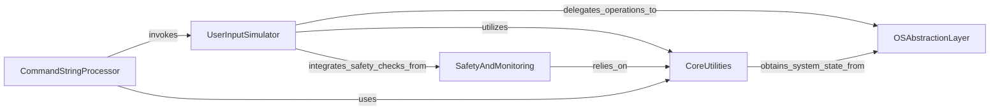

## Component Details

This component overview describes the structure and interactions of key subsystems within PyAutoGUI, focusing on how user input simulation, core utilities, safety mechanisms, command processing, and operating system interactions are managed. The main flow involves user input commands being processed and normalized by the UserInputSimulator, which then delegates low-level operations to the OSAbstractionLayer. SafetyAndMonitoring ensures failsafe operations and provides system information, while CoreUtilities offers fundamental functionalities like mouse position and screen size. The CommandStringProcessor allows for executing complex automation scripts from a single string by invoking other components.

### CoreUtilities
Provides fundamental utility functions such as getting mouse position, screen size, handling point objects, and managing core exceptions. It also includes basic image location capabilities.

**Related Classes/Methods**:

- <a href="https://github.com/asweigart/pyautogui/blob/master/pyautogui/__init__.py#L752-L774" target="_blank" rel="noopener noreferrer">`pyautogui.__init__.position` (752:774)</a>
- <a href="https://github.com/asweigart/pyautogui/blob/master/pyautogui/__init__.py#L777-L783" target="_blank" rel="noopener noreferrer">`pyautogui.__init__.size` (777:783)</a>
- <a href="https://github.com/asweigart/pyautogui/blob/master/pyautogui/__init__.py#L307-L307" target="_blank" rel="noopener noreferrer">`pyautogui.__init__.Point` (307:307)</a>
- <a href="https://github.com/asweigart/pyautogui/blob/master/pyautogui/__init__.py#L29-L36" target="_blank" rel="noopener noreferrer">`pyautogui.__init__.PyAutoGUIException` (29:36)</a>
- <a href="https://github.com/asweigart/pyautogui/blob/master/pyautogui/__init__.py#L39-L46" target="_blank" rel="noopener noreferrer">`pyautogui.__init__.FailSafeException` (39:46)</a>
- <a href="https://github.com/asweigart/pyautogui/blob/master/pyautogui/__init__.py#L617-L628" target="_blank" rel="noopener noreferrer">`pyautogui.__init__.linear` (617:628)</a>
- <a href="https://github.com/asweigart/pyautogui/blob/master/pyautogui/__init__.py#L605-L614" target="_blank" rel="noopener noreferrer">`pyautogui.__init__.getPointOnLine` (605:614)</a>
- <a href="https://github.com/asweigart/pyautogui/blob/master/pyautogui/__init__.py#L789-L809" target="_blank" rel="noopener noreferrer">`pyautogui.__init__.onScreen` (789:809)</a>
- <a href="https://github.com/asweigart/pyautogui/blob/master/pyautogui/__init__.py#L234-L237" target="_blank" rel="noopener noreferrer">`pyautogui.__init__.locateOnScreen` (234:237)</a>

### UserInputSimulator
Orchestrates high-level simulation of user inputs like mouse clicks, movements, and keyboard presses. It normalizes input arguments and interacts with the OS Abstraction Layer to perform actions.

**Related Classes/Methods**:

- <a href="https://github.com/asweigart/pyautogui/blob/master/pyautogui/__init__.py#L949-L1003" target="_blank" rel="noopener noreferrer">`pyautogui.__init__.click` (949:1003)</a>
- <a href="https://github.com/asweigart/pyautogui/blob/master/pyautogui/__init__.py#L1417-L1514" target="_blank" rel="noopener noreferrer">`pyautogui.__init__._mouseMoveDrag` (1417:1514)</a>
- <a href="https://github.com/asweigart/pyautogui/blob/master/pyautogui/__init__.py#L1582-L1616" target="_blank" rel="noopener noreferrer">`pyautogui.__init__.press` (1582:1616)</a>
- <a href="https://github.com/asweigart/pyautogui/blob/master/pyautogui/__init__.py#L1621-L1654" target="_blank" rel="noopener noreferrer">`pyautogui.__init__.hold` (1621:1654)</a>
- <a href="https://github.com/asweigart/pyautogui/blob/master/pyautogui/__init__.py#L1658-L1687" target="_blank" rel="noopener noreferrer">`pyautogui.__init__.typewrite` (1658:1687)</a>
- <a href="https://github.com/asweigart/pyautogui/blob/master/pyautogui/__init__.py#L642-L703" target="_blank" rel="noopener noreferrer">`pyautogui.__init__._normalizeXYArgs` (642:703)</a>
- <a href="https://github.com/asweigart/pyautogui/blob/master/pyautogui/__init__.py#L825-L879" target="_blank" rel="noopener noreferrer">`pyautogui.__init__._normalizeButton` (825:879)</a>
- <a href="https://github.com/asweigart/pyautogui/blob/master/pyautogui/__init__.py#L706-L749" target="_blank" rel="noopener noreferrer">`pyautogui.__init__._logScreenshot` (706:749)</a>

### SafetyAndMonitoring
Implements the failsafe mechanism to prevent unintended actions and provides functions for displaying and retrieving system information, including handling image not found exceptions.

**Related Classes/Methods**:

- <a href="https://github.com/asweigart/pyautogui/blob/master/pyautogui/__init__.py#L1732-L1736" target="_blank" rel="noopener noreferrer">`pyautogui.__init__.failSafeCheck` (1732:1736)</a>
- <a href="https://github.com/asweigart/pyautogui/blob/master/pyautogui/__init__.py#L585-L598" target="_blank" rel="noopener noreferrer">`pyautogui.__init__._genericPyAutoGUIChecks` (585:598)</a>
- <a href="https://github.com/asweigart/pyautogui/blob/master/pyautogui/__init__.py#L1739-L1776" target="_blank" rel="noopener noreferrer">`pyautogui.__init__.displayMousePosition` (1739:1776)</a>
- <a href="https://github.com/asweigart/pyautogui/blob/master/pyautogui/__init__.py#L2150-L2162" target="_blank" rel="noopener noreferrer">`pyautogui.__init__.printInfo` (2150:2162)</a>
- <a href="https://github.com/asweigart/pyautogui/blob/master/pyautogui/__init__.py#L2165-L2166" target="_blank" rel="noopener noreferrer">`pyautogui.__init__.getInfo` (2165:2166)</a>
- <a href="https://github.com/asweigart/pyautogui/blob/master/pyautogui/__init__.py#L267-L281" target="_blank" rel="noopener noreferrer">`pyautogui.__init__.useImageNotFoundException` (267:281)</a>
- <a href="https://github.com/asweigart/pyautogui/blob/master/pyautogui/__init__.py#L49-L55" target="_blank" rel="noopener noreferrer">`pyautogui.__init__.ImageNotFoundException` (49:55)</a>

### CommandStringProcessor
Parses and executes a sequence of PyAutoGUI commands provided as a single string, enabling complex automation scripts through a simplified interface.

**Related Classes/Methods**:

- <a href="https://github.com/asweigart/pyautogui/blob/master/pyautogui/__init__.py#L1905-L2028" target="_blank" rel="noopener noreferrer">`pyautogui.__init__._tokenizeCommandStr` (1905:2028)</a>
- <a href="https://github.com/asweigart/pyautogui/blob/master/pyautogui/__init__.py#L2031-L2086" target="_blank" rel="noopener noreferrer">`pyautogui.__init__._runCommandList` (2031:2086)</a>
- <a href="https://github.com/asweigart/pyautogui/blob/master/pyautogui/__init__.py#L1816-L1832" target="_blank" rel="noopener noreferrer">`pyautogui.__init__._getNumberToken` (1816:1832)</a>
- <a href="https://github.com/asweigart/pyautogui/blob/master/pyautogui/__init__.py#L1835-L1849" target="_blank" rel="noopener noreferrer">`pyautogui.__init__._getQuotedStringToken` (1835:1849)</a>
- <a href="https://github.com/asweigart/pyautogui/blob/master/pyautogui/__init__.py#L1852-L1886" target="_blank" rel="noopener noreferrer">`pyautogui.__init__._getParensCommandStrToken` (1852:1886)</a>
- <a href="https://github.com/asweigart/pyautogui/blob/master/pyautogui/__init__.py#L1889-L1902" target="_blank" rel="noopener noreferrer">`pyautogui.__init__._getCommaToken` (1889:1902)</a>

### OSAbstractionLayer
Provides a platform-specific interface for low-level interaction with the operating system's mouse and keyboard input mechanisms, abstracting OS-specific details.

**Related Classes/Methods**:

- <a href="https://github.com/asweigart/pyautogui/blob/master/pyautogui/_pyautogui_osx.py#L394-L401" target="_blank" rel="noopener noreferrer">`pyautogui._pyautogui_osx._mouse_is_swapped` (394:401)</a>
- <a href="https://github.com/asweigart/pyautogui/blob/master/pyautogui/_pyautogui_osx.py#L404-L427" target="_blank" rel="noopener noreferrer">`pyautogui._pyautogui_osx._multiClick` (404:427)</a>
- <a href="https://github.com/asweigart/pyautogui/blob/master/pyautogui/_pyautogui_osx.py#L377-L388" target="_blank" rel="noopener noreferrer">`pyautogui._pyautogui_osx._click` (377:388)</a>
- <a href="https://github.com/asweigart/pyautogui/blob/master/pyautogui/_pyautogui_osx.py#L446-L448" target="_blank" rel="noopener noreferrer">`pyautogui._pyautogui_osx._moveTo` (446:448)</a>
- <a href="https://github.com/asweigart/pyautogui/blob/master/pyautogui/_pyautogui_osx.py#L435-L444" target="_blank" rel="noopener noreferrer">`pyautogui._pyautogui_osx._dragTo` (435:444)</a>
- <a href="https://github.com/asweigart/pyautogui/blob/master/pyautogui/_pyautogui_osx.py#L219-L226" target="_blank" rel="noopener noreferrer">`pyautogui._pyautogui_osx._keyDown` (219:226)</a>
- <a href="https://github.com/asweigart/pyautogui/blob/master/pyautogui/_pyautogui_osx.py#L228-L235" target="_blank" rel="noopener noreferrer">`pyautogui._pyautogui_osx._keyUp` (228:235)</a>
- <a href="https://github.com/asweigart/pyautogui/blob/master/pyautogui/_pyautogui_osx.py#L295-L297" target="_blank" rel="noopener noreferrer">`pyautogui._pyautogui_osx._position` (295:297)</a>
- <a href="https://github.com/asweigart/pyautogui/blob/master/pyautogui/__init__.py#L1779-L1802" target="_blank" rel="noopener noreferrer">`pyautogui.__init__._snapshot` (1779:1802)</a>

### [FAQ](https://github.com/CodeBoarding/GeneratedOnBoardings/tree/main?tab=readme-ov-file#faq)