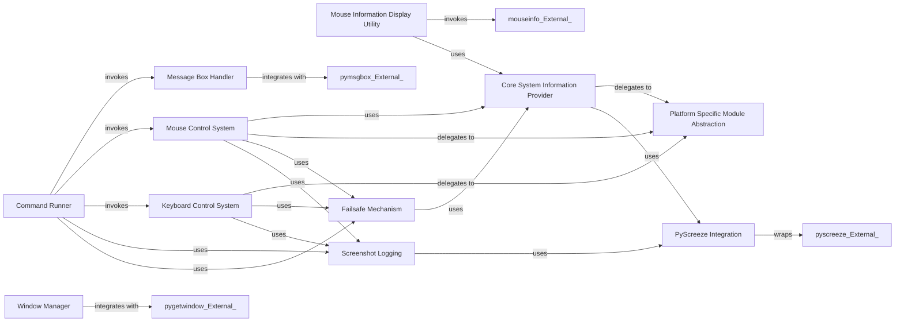

## Component Details

This subsystem of PyAutoGUI provides core functionalities for interacting with the graphical user interface, including displaying message boxes, managing windows, controlling mouse and keyboard inputs, and retrieving system information. It acts as an abstraction layer over various platform-specific and external libraries to offer a unified API for GUI automation.

### Message Box Handler
Manages the display of various types of message boxes (alerts, confirmations, prompts, password inputs) to the user, by integrating with the external `pymsgbox` library.

**Related Classes/Methods**:

- <a href="https://github.com/asweigart/pyautogui/blob/master/pyautogui/__init__.py#L50-L50" target="_blank" rel="noopener noreferrer">`pyautogui.__init__:alert` (50:50)</a>
- <a href="https://github.com/asweigart/pyautogui/blob/master/pyautogui/__init__.py#L50-L50" target="_blank" rel="noopener noreferrer">`pyautogui.__init__:confirm` (50:50)</a>
- <a href="https://github.com/asweigart/pyautogui/blob/master/pyautogui/__init__.py#L50-L50" target="_blank" rel="noopener noreferrer">`pyautogui.__init__:prompt` (50:50)</a>
- <a href="https://github.com/asweigart/pyautogui/blob/master/pyautogui/__init__.py#L50-L50" target="_blank" rel="noopener noreferrer">`pyautogui.__init__:password` (50:50)</a>
- <a href="https://github.com/asweigart/pyautogui/blob/master/pyautogui/__init__.py#L47-L49" target="_blank" rel="noopener noreferrer">`pyautogui.__init__:_couldNotImportPyMsgBox` (47:49)</a>

### Window Manager
Provides functionalities for interacting with and managing windows, including retrieving active windows, finding windows by title or position, and listing all open windows, by integrating with the external `pygetwindow` library.

**Related Classes/Methods**:

- <a href="https://github.com/asweigart/pyautogui/blob/master/pyautogui/__init__.py#L127-L133" target="_blank" rel="noopener noreferrer">`pyautogui.__init__:Window` (127:133)</a>
- <a href="https://github.com/asweigart/pyautogui/blob/master/pyautogui/__init__.py#L127-L133" target="_blank" rel="noopener noreferrer">`pyautogui.__init__:getActiveWindow` (127:133)</a>
- <a href="https://github.com/asweigart/pyautogui/blob/master/pyautogui/__init__.py#L127-L133" target="_blank" rel="noopener noreferrer">`pyautogui.__init__:getActiveWindowTitle` (127:133)</a>
- <a href="https://github.com/asweigart/pyautogui/blob/master/pyautogui/__init__.py#L127-L133" target="_blank" rel="noopener noreferrer">`pyautogui.__init__:getWindowsAt` (127:133)</a>
- <a href="https://github.com/asweigart/pyautogui/blob/master/pyautogui/__init__.py#L127-L133" target="_blank" rel="noopener noreferrer">`pyautogui.__init__:getWindowsWithTitle` (127:133)</a>
- <a href="https://github.com/asweigart/pyautogui/blob/master/pyautogui/__init__.py#L127-L133" target="_blank" rel="noopener noreferrer">`pyautogui.__init__:getAllWindows` (127:133)</a>
- <a href="https://github.com/asweigart/pyautogui/blob/master/pyautogui/__init__.py#L127-L133" target="_blank" rel="noopener noreferrer">`pyautogui.__init__:getAllTitles` (127:133)</a>
- <a href="https://github.com/asweigart/pyautogui/blob/master/pyautogui/__init__.py#L135-L141" target="_blank" rel="noopener noreferrer">`pyautogui.__init__:_couldNotImportPyGetWindow` (135:141)</a>

### Mouse Information Display Utility
Offers a user-friendly utility for displaying real-time information about the mouse cursor, such as its current coordinates and the color of the pixel under it, by launching the `mouseinfo` application.

**Related Classes/Methods**:

- <a href="https://github.com/asweigart/pyautogui/blob/master/pyautogui/__init__.py#L110-L116" target="_blank" rel="noopener noreferrer">`pyautogui.__init__:mouseInfo` (110:116)</a>

### Core System Information Provider
Responsible for the low-level retrieval of system-specific mouse position, screen dimensions, and pixel color, serving as a foundational data provider for higher-level utilities. It abstracts platform-specific implementations.

**Related Classes/Methods**:

- <a href="https://github.com/asweigart/pyautogui/blob/master/pyautogui/__init__.py#L752-L774" target="_blank" rel="noopener noreferrer">`pyautogui.__init__:position` (752:774)</a>
- <a href="https://github.com/asweigart/pyautogui/blob/master/pyautogui/__init__.py#L777-L783" target="_blank" rel="noopener noreferrer">`pyautogui.__init__:size` (777:783)</a>
- <a href="https://github.com/asweigart/pyautogui/blob/master/pyautogui/__init__.py#L2165-L2166" target="_blank" rel="noopener noreferrer">`pyautogui.__init__:getInfo` (2165:2166)</a>
- <a href="https://github.com/asweigart/pyautogui/blob/master/pyautogui/__init__.py#L789-L809" target="_blank" rel="noopener noreferrer">`pyautogui.__init__:onScreen` (789:809)</a>
- <a href="https://github.com/asweigart/pyautogui/blob/master/pyautogui/__init__.py#L1739-L1776" target="_blank" rel="noopener noreferrer">`pyautogui.__init__:displayMousePosition` (1739:1776)</a>

### PyScreeze Integration
Handles the integration with the `pyscreeze` library for screenshot capabilities and image location functionalities, adapting its exceptions for `pyautogui`.

**Related Classes/Methods**:

- <a href="https://github.com/asweigart/pyautogui/blob/master/pyautogui/__init__.py#L162-L176" target="_blank" rel="noopener noreferrer">`pyautogui.__init__:raisePyAutoGUIImageNotFoundException` (162:176)</a>
- <a href="https://github.com/asweigart/pyautogui/blob/master/pyautogui/__init__.py#L84-L86" target="_blank" rel="noopener noreferrer">`pyautogui.__init__:locate` (84:86)</a>
- <a href="https://github.com/asweigart/pyautogui/blob/master/pyautogui/__init__.py#L89-L91" target="_blank" rel="noopener noreferrer">`pyautogui.__init__:locateAll` (89:91)</a>
- <a href="https://github.com/asweigart/pyautogui/blob/master/pyautogui/__init__.py#L94-L96" target="_blank" rel="noopener noreferrer">`pyautogui.__init__:locateAllOnScreen` (94:96)</a>
- <a href="https://github.com/asweigart/pyautogui/blob/master/pyautogui/__init__.py#L99-L101" target="_blank" rel="noopener noreferrer">`pyautogui.__init__:locateCenterOnScreen` (99:101)</a>
- <a href="https://github.com/asweigart/pyautogui/blob/master/pyautogui/__init__.py#L104-L106" target="_blank" rel="noopener noreferrer">`pyautogui.__init__:locateOnScreen` (104:106)</a>
- <a href="https://github.com/asweigart/pyautogui/blob/master/pyautogui/__init__.py#L109-L111" target="_blank" rel="noopener noreferrer">`pyautogui.__init__:locateOnWindow` (109:111)</a>
- <a href="https://github.com/asweigart/pyautogui/blob/master/pyautogui/__init__.py#L114-L116" target="_blank" rel="noopener noreferrer">`pyautogui.__init__:pixel` (114:116)</a>
- <a href="https://github.com/asweigart/pyautogui/blob/master/pyautogui/__init__.py#L119-L121" target="_blank" rel="noopener noreferrer">`pyautogui.__init__:pixelMatchesColor` (119:121)</a>
- <a href="https://github.com/asweigart/pyautogui/blob/master/pyautogui/__init__.py#L124-L126" target="_blank" rel="noopener noreferrer">`pyautogui.__init__:screenshot` (124:126)</a>
- <a href="https://github.com/asweigart/pyautogui/blob/master/pyautogui/__init__.py#L114-L121" target="_blank" rel="noopener noreferrer">`pyautogui.__init__:_couldNotImportPyScreeze` (114:121)</a>
- <a href="https://github.com/asweigart/pyautogui/blob/master/pyautogui/__init__.py#L267-L281" target="_blank" rel="noopener noreferrer">`pyautogui.__init__:useImageNotFoundException` (267:281)</a>

### Mouse Control System
Manages all mouse-related actions such as clicks, presses, releases, movements, and drags, providing a unified interface for these operations.

**Related Classes/Methods**:

- <a href="https://github.com/asweigart/pyautogui/blob/master/pyautogui/__init__.py#L883-L912" target="_blank" rel="noopener noreferrer">`pyautogui.__init__:mouseDown` (883:912)</a>
- <a href="https://github.com/asweigart/pyautogui/blob/master/pyautogui/__init__.py#L916-L945" target="_blank" rel="noopener noreferrer">`pyautogui.__init__:mouseUp` (916:945)</a>
- <a href="https://github.com/asweigart/pyautogui/blob/master/pyautogui/__init__.py#L949-L1003" target="_blank" rel="noopener noreferrer">`pyautogui.__init__:click` (949:1003)</a>
- <a href="https://github.com/asweigart/pyautogui/blob/master/pyautogui/__init__.py#L1007-L1033" target="_blank" rel="noopener noreferrer">`pyautogui.__init__:leftClick` (1007:1033)</a>
- <a href="https://github.com/asweigart/pyautogui/blob/master/pyautogui/__init__.py#L1037-L1061" target="_blank" rel="noopener noreferrer">`pyautogui.__init__:rightClick` (1037:1061)</a>
- <a href="https://github.com/asweigart/pyautogui/blob/master/pyautogui/__init__.py#L1065-L1086" target="_blank" rel="noopener noreferrer">`pyautogui.__init__:middleClick` (1065:1086)</a>
- <a href="https://github.com/asweigart/pyautogui/blob/master/pyautogui/__init__.py#L1090-L1129" target="_blank" rel="noopener noreferrer">`pyautogui.__init__:doubleClick` (1090:1129)</a>
- <a href="https://github.com/asweigart/pyautogui/blob/master/pyautogui/__init__.py#L1133-L1171" target="_blank" rel="noopener noreferrer">`pyautogui.__init__:tripleClick` (1133:1171)</a>
- <a href="https://github.com/asweigart/pyautogui/blob/master/pyautogui/__init__.py#L1175-L1201" target="_blank" rel="noopener noreferrer">`pyautogui.__init__:scroll` (1175:1201)</a>
- <a href="https://github.com/asweigart/pyautogui/blob/master/pyautogui/__init__.py#L1205-L1229" target="_blank" rel="noopener noreferrer">`pyautogui.__init__:hscroll` (1205:1229)</a>
- <a href="https://github.com/asweigart/pyautogui/blob/master/pyautogui/__init__.py#L1233-L1257" target="_blank" rel="noopener noreferrer">`pyautogui.__init__:vscroll` (1233:1257)</a>
- <a href="https://github.com/asweigart/pyautogui/blob/master/pyautogui/__init__.py#L1261-L1288" target="_blank" rel="noopener noreferrer">`pyautogui.__init__:moveTo` (1261:1288)</a>
- <a href="https://github.com/asweigart/pyautogui/blob/master/pyautogui/__init__.py#L1292-L1318" target="_blank" rel="noopener noreferrer">`pyautogui.__init__:moveRel` (1292:1318)</a>
- <a href="https://github.com/asweigart/pyautogui/blob/master/pyautogui/__init__.py#L1325-L1362" target="_blank" rel="noopener noreferrer">`pyautogui.__init__:dragTo` (1325:1362)</a>
- <a href="https://github.com/asweigart/pyautogui/blob/master/pyautogui/__init__.py#L1366-L1411" target="_blank" rel="noopener noreferrer">`pyautogui.__init__:dragRel` (1366:1411)</a>
- <a href="https://github.com/asweigart/pyautogui/blob/master/pyautogui/__init__.py#L825-L879" target="_blank" rel="noopener noreferrer">`pyautogui.__init__:_normalizeButton` (825:879)</a>
- <a href="https://github.com/asweigart/pyautogui/blob/master/pyautogui/__init__.py#L1417-L1514" target="_blank" rel="noopener noreferrer">`pyautogui.__init__:_mouseMoveDrag` (1417:1514)</a>
- <a href="https://github.com/asweigart/pyautogui/blob/master/pyautogui/__init__.py#L642-L703" target="_blank" rel="noopener noreferrer">`pyautogui.__init__:_normalizeXYArgs` (642:703)</a>

### Keyboard Control System
Manages all keyboard-related actions such as key presses, releases, typing messages, and hotkey combinations.

**Related Classes/Methods**:

- <a href="https://github.com/asweigart/pyautogui/blob/master/pyautogui/__init__.py#L1521-L1538" target="_blank" rel="noopener noreferrer">`pyautogui.__init__:isValidKey` (1521:1538)</a>
- <a href="https://github.com/asweigart/pyautogui/blob/master/pyautogui/__init__.py#L1542-L1560" target="_blank" rel="noopener noreferrer">`pyautogui.__init__:keyDown` (1542:1560)</a>
- <a href="https://github.com/asweigart/pyautogui/blob/master/pyautogui/__init__.py#L1564-L1578" target="_blank" rel="noopener noreferrer">`pyautogui.__init__:keyUp` (1564:1578)</a>
- <a href="https://github.com/asweigart/pyautogui/blob/master/pyautogui/__init__.py#L1582-L1616" target="_blank" rel="noopener noreferrer">`pyautogui.__init__:press` (1582:1616)</a>
- <a href="https://github.com/asweigart/pyautogui/blob/master/pyautogui/__init__.py#L1621-L1654" target="_blank" rel="noopener noreferrer">`pyautogui.__init__:hold` (1621:1654)</a>
- <a href="https://github.com/asweigart/pyautogui/blob/master/pyautogui/__init__.py#L1658-L1687" target="_blank" rel="noopener noreferrer">`pyautogui.__init__:typewrite` (1658:1687)</a>
- <a href="https://github.com/asweigart/pyautogui/blob/master/pyautogui/__init__.py#L1694-L1726" target="_blank" rel="noopener noreferrer">`pyautogui.__init__:hotkey` (1694:1726)</a>

### Failsafe Mechanism
Implements a safety feature that raises an exception if the mouse cursor is moved to predefined 'failsafe points' (screen corners), preventing runaway scripts.

**Related Classes/Methods**:

- <a href="https://github.com/asweigart/pyautogui/blob/master/pyautogui/__init__.py#L1732-L1736" target="_blank" rel="noopener noreferrer">`pyautogui.__init__:failSafeCheck` (1732:1736)</a>
- <a href="https://github.com/asweigart/pyautogui/blob/master/pyautogui/__init__.py#L39-L46" target="_blank" rel="noopener noreferrer">`pyautogui.__init__:FailSafeException` (39:46)</a>
- <a href="https://github.com/asweigart/pyautogui/blob/master/pyautogui/__init__.py#L229-L229" target="_blank" rel="noopener noreferrer">`pyautogui.__init__:FAILSAFE` (229:229)</a>
- <a href="https://github.com/asweigart/pyautogui/blob/master/pyautogui/__init__.py#L230-L230" target="_blank" rel="noopener noreferrer">`pyautogui.__init__:FAILSAFE_POINTS` (230:230)</a>

### Command Runner
Provides a mini-language interpreter to execute a sequence of PyAutoGUI commands from a string, enabling script-like execution.

**Related Classes/Methods**:

- <a href="https://github.com/asweigart/pyautogui/blob/master/pyautogui/__init__.py#L2089-L2147" target="_blank" rel="noopener noreferrer">`pyautogui.__init__:run` (2089:2147)</a>
- <a href="https://github.com/asweigart/pyautogui/blob/master/pyautogui/__init__.py#L1905-L2028" target="_blank" rel="noopener noreferrer">`pyautogui.__init__:_tokenizeCommandStr` (1905:2028)</a>
- <a href="https://github.com/asweigart/pyautogui/blob/master/pyautogui/__init__.py#L2031-L2086" target="_blank" rel="noopener noreferrer">`pyautogui.__init__:_runCommandList` (2031:2086)</a>
- <a href="https://github.com/asweigart/pyautogui/blob/master/pyautogui/__init__.py#L1816-L1832" target="_blank" rel="noopener noreferrer">`pyautogui.__init__:_getNumberToken` (1816:1832)</a>
- <a href="https://github.com/asweigart/pyautogui/blob/master/pyautogui/__init__.py#L1835-L1849" target="_blank" rel="noopener noreferrer">`pyautogui.__init__:_getQuotedStringToken` (1835:1849)</a>
- <a href="https://github.com/asweigart/pyautogui/blob/master/pyautogui/__init__.py#L1852-L1886" target="_blank" rel="noopener noreferrer">`pyautogui.__init__:_getParensCommandStrToken` (1852:1886)</a>
- <a href="https://github.com/asweigart/pyautogui/blob/master/pyautogui/__init__.py#L1889-L1902" target="_blank" rel="noopener noreferrer">`pyautogui.__init__:_getCommaToken` (1889:1902)</a>

### Screenshot Logging
Manages the logging of screenshots for debugging and auditing purposes, including filename generation and old screenshot deletion.

**Related Classes/Methods**:

- <a href="https://github.com/asweigart/pyautogui/blob/master/pyautogui/__init__.py#L706-L749" target="_blank" rel="noopener noreferrer">`pyautogui.__init__:_logScreenshot` (706:749)</a>
- <a href="https://github.com/asweigart/pyautogui/blob/master/pyautogui/__init__.py#L232-L232" target="_blank" rel="noopener noreferrer">`pyautogui.__init__:LOG_SCREENSHOTS` (232:232)</a>
- <a href="https://github.com/asweigart/pyautogui/blob/master/pyautogui/__init__.py#L235-L235" target="_blank" rel="noopener noreferrer">`pyautogui.__init__:LOG_SCREENSHOTS_LIMIT` (235:235)</a>
- <a href="https://github.com/asweigart/pyautogui/blob/master/pyautogui/__init__.py#L236-L236" target="_blank" rel="noopener noreferrer">`pyautogui.__init__:G_LOG_SCREENSHOTS_FILENAMES` (236:236)</a>

### Platform Specific Module Abstraction
Provides an abstraction layer for platform-specific implementations of core GUI automation functionalities (mouse, keyboard, screen information), allowing PyAutoGUI to be cross-platform.

**Related Classes/Methods**:

- <a href="https://github.com/asweigart/pyautogui/blob/master/pyautogui/__init__.py#L250-L258" target="_blank" rel="noopener noreferrer">`pyautogui.__init__:platformModule` (250:258)</a>
- `pyautogui.__init__:_pyautogui_osx` (full file reference)
- `pyautogui.__init__:_pyautogui_win` (full file reference)
- `pyautogui.__init__:_pyautogui_x11` (full file reference)

### [FAQ](https://github.com/CodeBoarding/GeneratedOnBoardings/tree/main?tab=readme-ov-file#faq)