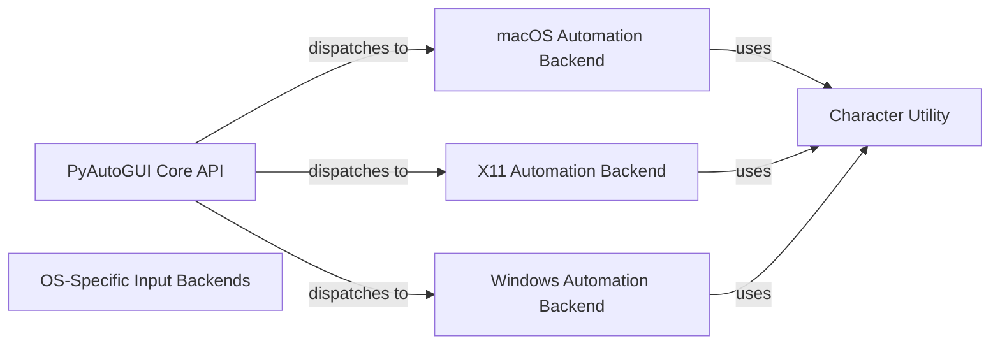

## Component Details

This system automates mouse and keyboard interactions across different operating systems. The PyAutoGUI Core API provides a high-level, cross-platform interface, which dispatches input requests to the OS-Specific Input Backends. This backend component dynamically loads the appropriate platform-dependent implementation (macOS Automation Backend, Windows Automation Backend, or X11 Automation Backend) to handle the low-level simulation of events. The specific automation backends also utilize the Character Utility to determine key press requirements.

### PyAutoGUI Core API
This component provides the high-level, cross-platform interface for automating mouse and keyboard interactions. It handles input normalization, incorporates failsafe mechanisms, logs actions, and acts as a dispatcher, routing requests to the appropriate operating system-specific backend for execution.

**Related Classes/Methods**:

- <a href="https://github.com/asweigart/pyautogui/blob/master/pyautogui/__init__.py#L752-L774" target="_blank" rel="noopener noreferrer">`pyautogui.__init__:position` (752:774)</a>
- <a href="https://github.com/asweigart/pyautogui/blob/master/pyautogui/__init__.py#L777-L783" target="_blank" rel="noopener noreferrer">`pyautogui.__init__:size` (777:783)</a>
- <a href="https://github.com/asweigart/pyautogui/blob/master/pyautogui/__init__.py#L789-L809" target="_blank" rel="noopener noreferrer">`pyautogui.__init__:onScreen` (789:809)</a>
- <a href="https://github.com/asweigart/pyautogui/blob/master/pyautogui/__init__.py#L825-L879" target="_blank" rel="noopener noreferrer">`pyautogui.__init__:_normalizeButton` (825:879)</a>
- <a href="https://github.com/asweigart/pyautogui/blob/master/pyautogui/__init__.py#L883-L912" target="_blank" rel="noopener noreferrer">`pyautogui.__init__:mouseDown` (883:912)</a>
- <a href="https://github.com/asweigart/pyautogui/blob/master/pyautogui/__init__.py#L916-L945" target="_blank" rel="noopener noreferrer">`pyautogui.__init__:mouseUp` (916:945)</a>
- <a href="https://github.com/asweigart/pyautogui/blob/master/pyautogui/__init__.py#L949-L1003" target="_blank" rel="noopener noreferrer">`pyautogui.__init__:click` (949:1003)</a>
- <a href="https://github.com/asweigart/pyautogui/blob/master/pyautogui/__init__.py#L1090-L1129" target="_blank" rel="noopener noreferrer">`pyautogui.__init__:doubleClick` (1090:1129)</a>
- <a href="https://github.com/asweigart/pyautogui/blob/master/pyautogui/__init__.py#L1133-L1171" target="_blank" rel="noopener noreferrer">`pyautogui.__init__:tripleClick` (1133:1171)</a>
- <a href="https://github.com/asweigart/pyautogui/blob/master/pyautogui/__init__.py#L1175-L1201" target="_blank" rel="noopener noreferrer">`pyautogui.__init__:scroll` (1175:1201)</a>
- <a href="https://github.com/asweigart/pyautogui/blob/master/pyautogui/__init__.py#L1205-L1229" target="_blank" rel="noopener noreferrer">`pyautogui.__init__:hscroll` (1205:1229)</a>
- <a href="https://github.com/asweigart/pyautogui/blob/master/pyautogui/__init__.py#L1233-L1257" target="_blank" rel="noopener noreferrer">`pyautogui.__init__:vscroll` (1233:1257)</a>
- <a href="https://github.com/asweigart/pyautogui/blob/master/pyautogui/__init__.py#L1417-L1514" target="_blank" rel="noopener noreferrer">`pyautogui.__init__:_mouseMoveDrag` (1417:1514)</a>
- <a href="https://github.com/asweigart/pyautogui/blob/master/pyautogui/__init__.py#L1542-L1560" target="_blank" rel="noopener noreferrer">`pyautogui.__init__:keyDown` (1542:1560)</a>
- <a href="https://github.com/asweigart/pyautogui/blob/master/pyautogui/__init__.py#L1564-L1578" target="_blank" rel="noopener noreferrer">`pyautogui.__init__:keyUp` (1564:1578)</a>
- <a href="https://github.com/asweigart/pyautogui/blob/master/pyautogui/__init__.py#L1582-L1616" target="_blank" rel="noopener noreferrer">`pyautogui.__init__:press` (1582:1616)</a>
- <a href="https://github.com/asweigart/pyautogui/blob/master/pyautogui/__init__.py#L1621-L1654" target="_blank" rel="noopener noreferrer">`pyautogui.__init__:hold` (1621:1654)</a>
- <a href="https://github.com/asweigart/pyautogui/blob/master/pyautogui/__init__.py#L1694-L1726" target="_blank" rel="noopener noreferrer">`pyautogui.__init__:hotkey` (1694:1726)</a>
- <a href="https://github.com/asweigart/pyautogui/blob/master/pyautogui/__init__.py#L1779-L1802" target="_blank" rel="noopener noreferrer">`pyautogui.__init__:_snapshot` (1779:1802)</a>
- <a href="https://github.com/asweigart/pyautogui/blob/master/pyautogui/__init__.py#L642-L703" target="_blank" rel="noopener noreferrer">`pyautogui.__init__._normalizeXYArgs` (642:703)</a>
- <a href="https://github.com/asweigart/pyautogui/blob/master/pyautogui/__init__.py#L706-L749" target="_blank" rel="noopener noreferrer">`pyautogui.__init__._logScreenshot` (706:749)</a>
- <a href="https://github.com/asweigart/pyautogui/blob/master/pyautogui/__init__.py#L1732-L1736" target="_blank" rel="noopener noreferrer">`pyautogui.__init__.failSafeCheck` (1732:1736)</a>
- <a href="https://github.com/asweigart/pyautogui/blob/master/pyautogui/__init__.py#L200-L200" target="_blank" rel="noopener noreferrer">`pyautogui.__init__.Point` (200:200)</a>
- <a href="https://github.com/asweigart/pyautogui/blob/master/pyautogui/__init__.py#L201-L201" target="_blank" rel="noopener noreferrer">`pyautogui.__init__.Size` (201:201)</a>
- <a href="https://github.com/asweigart/pyautogui/blob/master/pyautogui/__init__.py#L29-L36" target="_blank" rel="noopener noreferrer">`pyautogui.__init__.PyAutoGUIException` (29:36)</a>
- <a href="https://github.com/asweigart/pyautogui/blob/master/pyautogui/__init__.py#L605-L614" target="_blank" rel="noopener noreferrer">`pyautogui.__init__.getPointOnLine` (605:614)</a>
- <a href="https://github.com/asweigart/pyautogui/blob/master/pyautogui/__init__.py#L617-L628" target="_blank" rel="noopener noreferrer">`pyautogui.__init__.linear` (617:628)</a>

### OS-Specific Input Backends
This component represents the collection of low-level, platform-dependent implementations for simulating mouse and keyboard events. It includes the dynamic loading mechanism that selects the appropriate backend based on the operating system (macOS, Windows, or X11/Linux).

**Related Classes/Methods**:

- <a href="https://github.com/asweigart/pyautogui/blob/master/pyautogui/_pyautogui_osx.py#L1-L318" target="_blank" rel="noopener noreferrer">`pyautogui._pyautogui_osx` (1:318)</a>
- <a href="https://github.com/asweigart/pyautogui/blob/master/pyautogui/_pyautogui_win.py#L1-L439" target="_blank" rel="noopener noreferrer">`pyautogui._pyautogui_win` (1:439)</a>
- <a href="https://github.com/asweigart/pyautogui/blob/master/pyautogui/_pyautogui_x11.py#L1-L229" target="_blank" rel="noopener noreferrer">`pyautogui._pyautogui_x11` (1:229)</a>
- <a href="https://github.com/asweigart/pyautogui/blob/master/pyautogui/__init__.py#L150-L158" target="_blank" rel="noopener noreferrer">`pyautogui.__init__:platformModule` (150:158)</a>

### macOS Automation Backend
This component is responsible for implementing the low-level mouse and keyboard automation functionalities specifically tailored for the macOS operating system. It directly interacts with macOS system APIs to simulate user input events.

**Related Classes/Methods**:

- <a href="https://github.com/asweigart/pyautogui/blob/master/pyautogui/_pyautogui_osx.py#L219-L226" target="_blank" rel="noopener noreferrer">`pyautogui._pyautogui_osx:_keyDown` (219:226)</a>
- <a href="https://github.com/asweigart/pyautogui/blob/master/pyautogui/_pyautogui_osx.py#L228-L235" target="_blank" rel="noopener noreferrer">`pyautogui._pyautogui_osx:_keyUp` (228:235)</a>
- <a href="https://github.com/asweigart/pyautogui/blob/master/pyautogui/_pyautogui_osx.py#L238-L262" target="_blank" rel="noopener noreferrer">`pyautogui._pyautogui_osx:_normalKeyEvent` (238:262)</a>
- <a href="https://github.com/asweigart/pyautogui/blob/master/pyautogui/_pyautogui_osx.py#L264-L285" target="_blank" rel="noopener noreferrer">`pyautogui._pyautogui_osx:_specialKeyEvent` (264:285)</a>
- <a href="https://github.com/asweigart/pyautogui/blob/master/pyautogui/_pyautogui_osx.py#L305-L306" target="_blank" rel="noopener noreferrer">`pyautogui._pyautogui_osx:_scroll` (305:306)</a>
- <a href="https://github.com/asweigart/pyautogui/blob/master/pyautogui/_pyautogui_osx.py#L315-L331" target="_blank" rel="noopener noreferrer">`pyautogui._pyautogui_osx:_vscroll` (315:331)</a>
- <a href="https://github.com/asweigart/pyautogui/blob/master/pyautogui/_pyautogui_osx.py#L334-L352" target="_blank" rel="noopener noreferrer">`pyautogui._pyautogui_osx:_hscroll` (334:352)</a>
- <a href="https://github.com/asweigart/pyautogui/blob/master/pyautogui/_pyautogui_osx.py#L355-L363" target="_blank" rel="noopener noreferrer">`pyautogui._pyautogui_osx:_mouseDown` (355:363)</a>
- <a href="https://github.com/asweigart/pyautogui/blob/master/pyautogui/_pyautogui_osx.py#L366-L374" target="_blank" rel="noopener noreferrer">`pyautogui._pyautogui_osx:_mouseUp` (366:374)</a>
- <a href="https://github.com/asweigart/pyautogui/blob/master/pyautogui/_pyautogui_osx.py#L377-L388" target="_blank" rel="noopener noreferrer">`pyautogui._pyautogui_osx:_click` (377:388)</a>
- <a href="https://github.com/asweigart/pyautogui/blob/master/pyautogui/_pyautogui_osx.py#L404-L427" target="_blank" rel="noopener noreferrer">`pyautogui._pyautogui_osx:_multiClick` (404:427)</a>
- <a href="https://github.com/asweigart/pyautogui/blob/master/pyautogui/_pyautogui_osx.py#L435-L444" target="_blank" rel="noopener noreferrer">`pyautogui._pyautogui_osx:_dragTo` (435:444)</a>
- <a href="https://github.com/asweigart/pyautogui/blob/master/pyautogui/_pyautogui_osx.py#L446-L448" target="_blank" rel="noopener noreferrer">`pyautogui._pyautogui_osx:_moveTo` (446:448)</a>
- <a href="https://github.com/asweigart/pyautogui/blob/master/pyautogui/_pyautogui_osx.py#L430-L432" target="_blank" rel="noopener noreferrer">`pyautogui._pyautogui_osx:_sendMouseEvent` (430:432)</a>
- <a href="https://github.com/asweigart/pyautogui/blob/master/pyautogui/_pyautogui_osx.py#L295-L297" target="_blank" rel="noopener noreferrer">`pyautogui._pyautogui_osx._position` (295:297)</a>
- <a href="https://github.com/asweigart/pyautogui/blob/master/pyautogui/_pyautogui_osx.py#L300-L301" target="_blank" rel="noopener noreferrer">`pyautogui._pyautogui_osx._size` (300:301)</a>
- <a href="https://github.com/asweigart/pyautogui/blob/master/pyautogui/_pyautogui_osx.py#L394-L401" target="_blank" rel="noopener noreferrer">`pyautogui._pyautogui_osx._mouse_is_swapped` (394:401)</a>

### X11 Automation Backend
This component provides the low-level mouse and keyboard automation capabilities for X11-based systems, such as Linux. It interacts with the X server to generate and send input events.

**Related Classes/Methods**:

- <a href="https://github.com/asweigart/pyautogui/blob/master/pyautogui/_pyautogui_x11.py#L42-L52" target="_blank" rel="noopener noreferrer">`pyautogui._pyautogui_x11:_vscroll` (42:52)</a>
- <a href="https://github.com/asweigart/pyautogui/blob/master/pyautogui/_pyautogui_x11.py#L55-L65" target="_blank" rel="noopener noreferrer">`pyautogui._pyautogui_x11:_hscroll` (55:65)</a>
- <a href="https://github.com/asweigart/pyautogui/blob/master/pyautogui/_pyautogui_x11.py#L68-L69" target="_blank" rel="noopener noreferrer">`pyautogui._pyautogui_x11:_scroll` (68:69)</a>
- <a href="https://github.com/asweigart/pyautogui/blob/master/pyautogui/_pyautogui_x11.py#L72-L77" target="_blank" rel="noopener noreferrer">`pyautogui._pyautogui_x11:_click` (72:77)</a>
- <a href="https://github.com/asweigart/pyautogui/blob/master/pyautogui/_pyautogui_x11.py#L105-L110" target="_blank" rel="noopener noreferrer">`pyautogui._pyautogui_x11:_mouseDown` (105:110)</a>
- <a href="https://github.com/asweigart/pyautogui/blob/master/pyautogui/_pyautogui_x11.py#L113-L118" target="_blank" rel="noopener noreferrer">`pyautogui._pyautogui_x11:_mouseUp` (113:118)</a>
- <a href="https://github.com/asweigart/pyautogui/blob/master/pyautogui/_pyautogui_x11.py#L121-L151" target="_blank" rel="noopener noreferrer">`pyautogui._pyautogui_x11:_keyDown` (121:151)</a>
- <a href="https://github.com/asweigart/pyautogui/blob/master/pyautogui/_pyautogui_x11.py#L100-L102" target="_blank" rel="noopener noreferrer">`pyautogui._pyautogui_x11:_moveTo` (100:102)</a>
- <a href="https://github.com/asweigart/pyautogui/blob/master/pyautogui/_pyautogui_x11.py#L26-L34" target="_blank" rel="noopener noreferrer">`pyautogui._pyautogui_x11._position` (26:34)</a>
- <a href="https://github.com/asweigart/pyautogui/blob/master/pyautogui/_pyautogui_x11.py#L37-L38" target="_blank" rel="noopener noreferrer">`pyautogui._pyautogui_x11._size` (37:38)</a>

### Windows Automation Backend
This component is dedicated to implementing the low-level mouse and keyboard automation functionalities for the Windows operating system. It leverages Windows API calls to simulate user input.

**Related Classes/Methods**:

- <a href="https://github.com/asweigart/pyautogui/blob/master/pyautogui/_pyautogui_win.py#L250-L292" target="_blank" rel="noopener noreferrer">`pyautogui._pyautogui_win:_keyDown` (250:292)</a>
- <a href="https://github.com/asweigart/pyautogui/blob/master/pyautogui/_pyautogui_win.py#L295-L332" target="_blank" rel="noopener noreferrer">`pyautogui._pyautogui_win:_keyUp` (295:332)</a>
- <a href="https://github.com/asweigart/pyautogui/blob/master/pyautogui/_pyautogui_win.py#L375-L401" target="_blank" rel="noopener noreferrer">`pyautogui._pyautogui_win:_mouseDown` (375:401)</a>
- <a href="https://github.com/asweigart/pyautogui/blob/master/pyautogui/_pyautogui_win.py#L404-L429" target="_blank" rel="noopener noreferrer">`pyautogui._pyautogui_win:_mouseUp` (404:429)</a>
- <a href="https://github.com/asweigart/pyautogui/blob/master/pyautogui/_pyautogui_win.py#L432-L458" target="_blank" rel="noopener noreferrer">`pyautogui._pyautogui_win:_click` (432:458)</a>
- <a href="https://github.com/asweigart/pyautogui/blob/master/pyautogui/_pyautogui_win.py#L466-L500" target="_blank" rel="noopener noreferrer">`pyautogui._pyautogui_win:_sendMouseEvent` (466:500)</a>
- <a href="https://github.com/asweigart/pyautogui/blob/master/pyautogui/_pyautogui_win.py#L507-L541" target="_blank" rel="noopener noreferrer">`pyautogui._pyautogui_win:_scroll` (507:541)</a>
- <a href="https://github.com/asweigart/pyautogui/blob/master/pyautogui/_pyautogui_win.py#L544-L557" target="_blank" rel="noopener noreferrer">`pyautogui._pyautogui_win:_hscroll` (544:557)</a>
- <a href="https://github.com/asweigart/pyautogui/blob/master/pyautogui/_pyautogui_win.py#L560-L572" target="_blank" rel="noopener noreferrer">`pyautogui._pyautogui_win:_vscroll` (560:572)</a>
- <a href="https://github.com/asweigart/pyautogui/blob/master/pyautogui/_pyautogui_win.py#L335-L345" target="_blank" rel="noopener noreferrer">`pyautogui._pyautogui_win._position` (335:345)</a>
- <a href="https://github.com/asweigart/pyautogui/blob/master/pyautogui/_pyautogui_win.py#L348-L354" target="_blank" rel="noopener noreferrer">`pyautogui._pyautogui_win._size` (348:354)</a>

### Character Utility
This component provides a utility function to determine if a given character requires the Shift key to be pressed for its input, assisting the OS-specific backends in simulating correct key presses.

**Related Classes/Methods**:

- `pyautogui.isShiftCharacter` (144:150)

### [FAQ](https://github.com/CodeBoarding/GeneratedOnBoardings/tree/main?tab=readme-ov-file#faq)