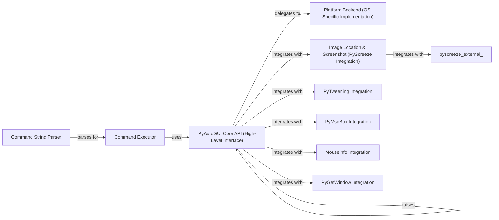

## Component Details

This graph illustrates the core components and their interactions within the PyAutoGUI library, focusing on how high-level user commands are translated into OS-specific actions. The central `PyAutoGUI Core API` acts as the primary interface, handling input normalization, general checks, and delegating tasks to the `Platform Backend` for low-level OS interactions. It also integrates with the `Image Location & Screenshot` component for visual automation tasks. The `PyAutoGUI Core API` also manages exceptions and provides utility functions for screen information and command execution.

### PyAutoGUI Core API (High-Level Interface)
The central module providing high-level functions for automating mouse, keyboard, and scroll actions. It orchestrates calls to OS-specific backends, handles general checks (failsafe, pause), coordinate normalization, basic geometric calculations, and defines core exception types. It acts as the primary interface for users.

**Related Classes/Methods**:

- <a href="https://github.com/asweigart/pyautogui/blob/master/pyautogui/__init__.py#L883-L912" target="_blank" rel="noopener noreferrer">`pyautogui.__init__:mouseDown` (883:912)</a>
- <a href="https://github.com/asweigart/pyautogui/blob/master/pyautogui/__init__.py#L916-L945" target="_blank" rel="noopener noreferrer">`pyautogui.__init__:mouseUp` (916:945)</a>
- <a href="https://github.com/asweigart/pyautogui/blob/master/pyautogui/__init__.py#L949-L1003" target="_blank" rel="noopener noreferrer">`pyautogui.__init__:click` (949:1003)</a>
- <a href="https://github.com/asweigart/pyautogui/blob/master/pyautogui/__init__.py#L1007-L1033" target="_blank" rel="noopener noreferrer">`pyautogui.__init__:leftClick` (1007:1033)</a>
- <a href="https://github.com/asweigart/pyautogui/blob/master/pyautogui/__init__.py#L1037-L1061" target="_blank" rel="noopener noreferrer">`pyautogui.__init__:rightClick` (1037:1061)</a>
- <a href="https://github.com/asweigart/pyautogui/blob/master/pyautogui/__init__.py#L1065-L1086" target="_blank" rel="noopener noreferrer">`pyautogui.__init__:middleClick` (1065:1086)</a>
- <a href="https://github.com/asweigart/pyautogui/blob/master/pyautogui/__init__.py#L1090-L1129" target="_blank" rel="noopener noreferrer">`pyautogui.__init__:doubleClick` (1090:1129)</a>
- <a href="https://github.com/asweigart/pyautogui/blob/master/pyautogui/__init__.py#L1133-L1171" target="_blank" rel="noopener noreferrer">`pyautogui.__init__:tripleClick` (1133:1171)</a>
- <a href="https://github.com/asweigart/pyautogui/blob/master/pyautogui/__init__.py#L1175-L1201" target="_blank" rel="noopener noreferrer">`pyautogui.__init__:scroll` (1175:1201)</a>
- <a href="https://github.com/asweigart/pyautogui/blob/master/pyautogui/__init__.py#L1205-L1229" target="_blank" rel="noopener noreferrer">`pyautogui.__init__:hscroll` (1205:1229)</a>
- <a href="https://github.com/asweigart/pyautogui/blob/master/pyautogui/__init__.py#L1233-L1257" target="_blank" rel="noopener noreferrer">`pyautogui.__init__:vscroll` (1233:1257)</a>
- <a href="https://github.com/asweigart/pyautogui/blob/master/pyautogui/__init__.py#L1261-L1288" target="_blank" rel="noopener noreferrer">`pyautogui.__init__:moveTo` (1261:1288)</a>
- <a href="https://github.com/asweigart/pyautogui/blob/master/pyautogui/__init__.py#L1292-L1318" target="_blank" rel="noopener noreferrer">`pyautogui.__init__:moveRel` (1292:1318)</a>
- <a href="https://github.com/asweigart/pyautogui/blob/master/pyautogui/__init__.py#L1325-L1362" target="_blank" rel="noopener noreferrer">`pyautogui.__init__:dragTo` (1325:1362)</a>
- <a href="https://github.com/asweigart/pyautogui/blob/master/pyautogui/__init__.py#L1366-L1411" target="_blank" rel="noopener noreferrer">`pyautogui.__init__:dragRel` (1366:1411)</a>
- <a href="https://github.com/asweigart/pyautogui/blob/master/pyautogui/__init__.py#L1542-L1560" target="_blank" rel="noopener noreferrer">`pyautogui.__init__:keyDown` (1542:1560)</a>
- <a href="https://github.com/asweigart/pyautogui/blob/master/pyautogui/__init__.py#L1564-L1578" target="_blank" rel="noopener noreferrer">`pyautogui.__init__:keyUp` (1564:1578)</a>
- <a href="https://github.com/asweigart/pyautogui/blob/master/pyautogui/__init__.py#L1582-L1616" target="_blank" rel="noopener noreferrer">`pyautogui.__init__:press` (1582:1616)</a>
- <a href="https://github.com/asweigart/pyautogui/blob/master/pyautogui/__init__.py#L1621-L1654" target="_blank" rel="noopener noreferrer">`pyautogui.__init__:hold` (1621:1654)</a>
- <a href="https://github.com/asweigart/pyautogui/blob/master/pyautogui/__init__.py#L1658-L1687" target="_blank" rel="noopener noreferrer">`pyautogui.__init__:typewrite` (1658:1687)</a>
- <a href="https://github.com/asweigart/pyautogui/blob/master/pyautogui/__init__.py#L1694-L1726" target="_blank" rel="noopener noreferrer">`pyautogui.__init__:hotkey` (1694:1726)</a>
- <a href="https://github.com/asweigart/pyautogui/blob/master/pyautogui/__init__.py#L752-L774" target="_blank" rel="noopener noreferrer">`pyautogui.__init__:position` (752:774)</a>
- <a href="https://github.com/asweigart/pyautogui/blob/master/pyautogui/__init__.py#L777-L783" target="_blank" rel="noopener noreferrer">`pyautogui.__init__:size` (777:783)</a>
- <a href="https://github.com/asweigart/pyautogui/blob/master/pyautogui/__init__.py#L789-L809" target="_blank" rel="noopener noreferrer">`pyautogui.__init__:onScreen` (789:809)</a>
- <a href="https://github.com/asweigart/pyautogui/blob/master/pyautogui/__init__.py#L170-L170" target="_blank" rel="noopener noreferrer">`pyautogui.__init__:Point` (170:170)</a>
- <a href="https://github.com/asweigart/pyautogui/blob/master/pyautogui/__init__.py#L171-L171" target="_blank" rel="noopener noreferrer">`pyautogui.__init__:Size` (171:171)</a>
- <a href="https://github.com/asweigart/pyautogui/blob/master/pyautogui/__init__.py#L642-L703" target="_blank" rel="noopener noreferrer">`pyautogui.__init__:_normalizeXYArgs` (642:703)</a>
- <a href="https://github.com/asweigart/pyautogui/blob/master/pyautogui/__init__.py#L825-L879" target="_blank" rel="noopener noreferrer">`pyautogui.__init__:_normalizeButton` (825:879)</a>
- <a href="https://github.com/asweigart/pyautogui/blob/master/pyautogui/__init__.py#L1417-L1514" target="_blank" rel="noopener noreferrer">`pyautogui.__init__:_mouseMoveDrag` (1417:1514)</a>
- <a href="https://github.com/asweigart/pyautogui/blob/master/pyautogui/__init__.py#L585-L598" target="_blank" rel="noopener noreferrer">`pyautogui.__init__:_genericPyAutoGUIChecks` (585:598)</a>
- <a href="https://github.com/asweigart/pyautogui/blob/master/pyautogui/__init__.py#L631-L639" target="_blank" rel="noopener noreferrer">`pyautogui.__init__:_handlePause` (631:639)</a>
- <a href="https://github.com/asweigart/pyautogui/blob/master/pyautogui/__init__.py#L706-L749" target="_blank" rel="noopener noreferrer">`pyautogui.__init__:_logScreenshot` (706:749)</a>
- <a href="https://github.com/asweigart/pyautogui/blob/master/pyautogui/__init__.py#L617-L628" target="_blank" rel="noopener noreferrer">`pyautogui.__init__:linear` (617:628)</a>
- <a href="https://github.com/asweigart/pyautogui/blob/master/pyautogui/__init__.py#L605-L614" target="_blank" rel="noopener noreferrer">`pyautogui.__init__:getPointOnLine` (605:614)</a>
- <a href="https://github.com/asweigart/pyautogui/blob/master/pyautogui/__init__.py#L526-L532" target="_blank" rel="noopener noreferrer">`pyautogui.__init__:isShiftCharacter` (526:532)</a>
- <a href="https://github.com/asweigart/pyautogui/blob/master/pyautogui/__init__.py#L1521-L1538" target="_blank" rel="noopener noreferrer">`pyautogui.__init__:isValidKey` (1521:1538)</a>
- `pyautogui.PyAutoGUIException` (17:24)
- `pyautogui.FailSafeException` (27:35)
- `pyautogui.ImageNotFoundException` (38:43)

### Platform Backend (OS-Specific Implementation)
Provides the low-level, OS-specific implementations for interacting with the operating system's mouse and keyboard events. It contains the actual calls to OS-specific APIs (e.g., Quartz/AppKit for macOS, Win32 API for Windows, X11 for Linux).

**Related Classes/Methods**:

- <a href="https://github.com/asweigart/pyautogui/blob/master/pyautogui/_pyautogui_osx.py#L295-L297" target="_blank" rel="noopener noreferrer">`pyautogui._pyautogui_osx._position` (295:297)</a>
- <a href="https://github.com/asweigart/pyautogui/blob/master/pyautogui/_pyautogui_osx.py#L300-L301" target="_blank" rel="noopener noreferrer">`pyautogui._pyautogui_osx._size` (300:301)</a>
- <a href="https://github.com/asweigart/pyautogui/blob/master/pyautogui/_pyautogui_osx.py#L355-L363" target="_blank" rel="noopener noreferrer">`pyautogui._pyautogui_osx._mouseDown` (355:363)</a>
- <a href="https://github.com/asweigart/pyautogui/blob/master/pyautogui/_pyautogui_osx.py#L366-L374" target="_blank" rel="noopener noreferrer">`pyautogui._pyautogui_osx._mouseUp` (366:374)</a>
- <a href="https://github.com/asweigart/pyautogui/blob/master/pyautogui/_pyautogui_osx.py#L377-L388" target="_blank" rel="noopener noreferrer">`pyautogui._pyautogui_osx._click` (377:388)</a>
- <a href="https://github.com/asweigart/pyautogui/blob/master/pyautogui/_pyautogui_osx.py#L404-L427" target="_blank" rel="noopener noreferrer">`pyautogui._pyautogui_osx._multiClick` (404:427)</a>
- <a href="https://github.com/asweigart/pyautogui/blob/master/pyautogui/_pyautogui_osx.py#L305-L306" target="_blank" rel="noopener noreferrer">`pyautogui._pyautogui_osx._scroll` (305:306)</a>
- <a href="https://github.com/asweigart/pyautogui/blob/master/pyautogui/_pyautogui_osx.py#L334-L352" target="_blank" rel="noopener noreferrer">`pyautogui._pyautogui_osx._hscroll` (334:352)</a>
- <a href="https://github.com/asweigart/pyautogui/blob/master/pyautogui/_pyautogui_osx.py#L315-L331" target="_blank" rel="noopener noreferrer">`pyautogui._pyautogui_osx._vscroll` (315:331)</a>
- <a href="https://github.com/asweigart/pyautogui/blob/master/pyautogui/_pyautogui_osx.py#L446-L448" target="_blank" rel="noopener noreferrer">`pyautogui._pyautogui_osx._moveTo` (446:448)</a>
- <a href="https://github.com/asweigart/pyautogui/blob/master/pyautogui/_pyautogui_osx.py#L435-L444" target="_blank" rel="noopener noreferrer">`pyautogui._pyautogui_osx._dragTo` (435:444)</a>
- <a href="https://github.com/asweigart/pyautogui/blob/master/pyautogui/_pyautogui_osx.py#L219-L226" target="_blank" rel="noopener noreferrer">`pyautogui._pyautogui_osx._keyDown` (219:226)</a>
- <a href="https://github.com/asweigart/pyautogui/blob/master/pyautogui/_pyautogui_osx.py#L228-L235" target="_blank" rel="noopener noreferrer">`pyautogui._pyautogui_osx._keyUp` (228:235)</a>
- <a href="https://github.com/asweigart/pyautogui/blob/master/pyautogui/_pyautogui_osx.py#L394-L401" target="_blank" rel="noopener noreferrer">`pyautogui._pyautogui_osx._mouse_is_swapped` (394:401)</a>
- `pyautogui._pyautogui_win` (full file reference)
- `pyautogui._pyautogui_x11` (full file reference)

### Image Location & Screenshot (PyScreeze Integration)
This component provides functionalities related to taking screenshots and locating images on the screen, primarily by integrating with the `pyscreeze` library. It also handles the `ImageNotFoundException` specific to PyAutoGUI.

**Related Classes/Methods**:

- `pyautogui.locateOnScreen` (300:301)
- `pyautogui.center` (269:269)
- `pyautogui.pixel` (269:269)
- `pyautogui.pixelMatchesColor` (269:269)
- `pyautogui.screenshot` (269:269)
- `pyautogui.raisePyAutoGUIImageNotFoundException` (248:265)

### PyTweening Integration
This component provides various tweening functions used for animating mouse movements, allowing for non-linear and more natural-looking cursor trajectories. It integrates with the `pytweening` library.

**Related Classes/Methods**:

- `pyautogui.easeInQuad` (52:52)
- `pyautogui.easeOutQuad` (53:53)
- `pyautogui.easeInOutQuad` (54:54)
- `pyautogui.easeInCubic` (55:55)
- `pyautogui.easeOutCubic` (56:56)
- `pyautogui.easeInOutCubic` (57:57)
- `pyautogui.easeInQuart` (58:58)
- `pyautogui.easeOutQuart` (59:59)
- `pyautogui.easeInOutQuart` (60:60)
- `pyautogui.easeInQuint` (61:61)
- `pyautogui.easeOutQuint` (62:62)
- `pyautogui.easeInOutQuint` (63:63)
- `pyautogui.easeInSine` (64:64)
- `pyautogui.easeOutSine` (65:65)
- `pyautogui.easeInOutSine` (66:66)
- `pyautogui.easeInExpo` (67:67)
- `pyautogui.easeOutExpo` (68:68)
- `pyautogui.easeInOutExpo` (69:69)
- `pyautogui.easeInCirc` (70:70)
- `pyautogui.easeOutCirc` (71:71)
- `pyautogui.easeInOutCirc` (72:72)
- `pyautogui.easeInElastic` (73:73)
- `pyautogui.easeOutElastic` (74:74)
- `pyautogui.easeInOutElastic` (75:75)
- `pyautogui.easeInBack` (76:76)
- `pyautogui.easeOutBack` (77:77)
- `pyautogui.easeInOutBack` (78:78)
- `pyautogui.easeInBounce` (79:79)
- `pyautogui.easeOutBounce` (80:80)
- `pyautogui.easeInOutBounce` (81:81)

### PyMsgBox Integration
This component provides functions for displaying simple message boxes (alerts, confirmations, prompts, and password inputs) to the user. It integrates with the `pymsgbox` library.

**Related Classes/Methods**:

- `pyautogui.alert` (110:110)
- `pyautogui.confirm` (110:110)
- `pyautogui.prompt` (110:110)
- `pyautogui.password` (110:110)

### MouseInfo Integration
This component provides a utility function to launch the MouseInfo application, which helps users identify mouse coordinates and RGB values on the screen. It integrates with the `mouseinfo` library.

**Related Classes/Methods**:

- `pyautogui.mouseInfo` (344:350)

### PyGetWindow Integration
This component provides functionalities for interacting with windows on the operating system, such as getting active windows, listing all windows, and retrieving window titles. It integrates with the `pygetwindow` library (currently Windows-only).

**Related Classes/Methods**:

- `pyautogui.Window` (381:381)
- `pyautogui.getActiveWindow` (382:382)
- `pyautogui.getActiveWindowTitle` (383:383)
- `pyautogui.getWindowsAt` (384:384)
- `pyautogui.getWindowsWithTitle` (385:385)
- `pyautogui.getAllWindows` (386:386)
- `pyautogui.getAllTitles` (387:387)

### Command String Parser
This component is responsible for parsing a mini-language command string into a structured list of commands and their arguments. It tokenizes the input string, handles different command types (mouse, keyboard, control flow), and performs basic validation.

**Related Classes/Methods**:

- <a href="https://github.com/asweigart/pyautogui/blob/master/pyautogui/__init__.py#L1816-L1832" target="_blank" rel="noopener noreferrer">`pyautogui.__init__:_getNumberToken` (1816:1832)</a>
- <a href="https://github.com/asweigart/pyautogui/blob/master/pyautogui/__init__.py#L1835-L1849" target="_blank" rel="noopener noreferrer">`pyautogui.__init__:_getQuotedStringToken` (1835:1849)</a>
- <a href="https://github.com/asweigart/pyautogui/blob/master/pyautogui/__init__.py#L1852-L1886" target="_blank" rel="noopener noreferrer">`pyautogui.__init__:_getParensCommandStrToken` (1852:1886)</a>
- <a href="https://github.com/asweigart/pyautogui/blob/master/pyautogui/__init__.py#L1889-L1902" target="_blank" rel="noopener noreferrer">`pyautogui.__init__:_getCommaToken` (1889:1902)</a>
- <a href="https://github.com/asweigart/pyautogui/blob/master/pyautogui/__init__.py#L1905-L2028" target="_blank" rel="noopener noreferrer">`pyautogui.__init__:_tokenizeCommandStr` (1905:2028)</a>

### Command Executor
This component takes a parsed list of commands and executes them by calling the corresponding PyAutoGUI functions. It manages the execution flow, including handling pauses and loops, and interacts with other PyAutoGUI components to perform the requested actions.

**Related Classes/Methods**:

- <a href="https://github.com/asweigart/pyautogui/blob/master/pyautogui/__init__.py#L2031-L2086" target="_blank" rel="noopener noreferrer">`pyautogui.__init__:_runCommandList` (2031:2086)</a>
- <a href="https://github.com/asweigart/pyautogui/blob/master/pyautogui/__init__.py#L2089-L2147" target="_blank" rel="noopener noreferrer">`pyautogui.__init__:run` (2089:2147)</a>

### [FAQ](https://github.com/CodeBoarding/GeneratedOnBoardings/tree/main?tab=readme-ov-file#faq)