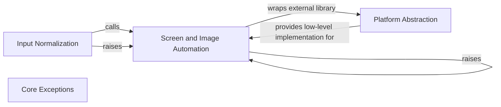

## Component Details

This graph illustrates the structure and interactions of the `Screen and Image Automation` component within the PyAutoGUI library. This component is central to image-based automation, providing functionalities for screen capturing, image location, and pixel analysis. It relies on `Platform Abstraction` for low-level operating system interactions, receives normalized inputs from `Input Normalization`, and manages its own specific exceptions, which are part of the broader `Core Exceptions` system.

### Screen and Image Automation
This component provides comprehensive functionalities for interacting with the screen, including capturing screenshots, locating images or specific regions on the screen, and retrieving pixel color information. It is essential for image-based automation tasks.

**Related Classes/Methods**:

- <a href="https://github.com/asweigart/pyautogui/blob/master/pyautogui/__init__.py#L80-L82" target="_blank" rel="noopener noreferrer">`pyautogui.__init__.locate` (80:82)</a>
- <a href="https://github.com/asweigart/pyautogui/blob/master/pyautogui/__init__.py#L85-L87" target="_blank" rel="noopener noreferrer">`pyautogui.__init__.locateAll` (85:87)</a>
- <a href="https://github.com/asweigart/pyautogui/blob/master/pyautogui/__init__.py#L90-L92" target="_blank" rel="noopener noreferrer">`pyautogui.__init__.locateAllOnScreen` (90:92)</a>
- <a href="https://github.com/asweigart/pyautogui/blob/master/pyautogui/__init__.py#L95-L97" target="_blank" rel="noopener noreferrer">`pyautogui.__init__.locateCenterOnScreen` (95:97)</a>
- <a href="https://github.com/asweigart/pyautogui/blob/master/pyautogui/__init__.py#L100-L102" target="_blank" rel="noopener noreferrer">`pyautogui.__init__.locateOnScreen` (100:102)</a>
- <a href="https://github.com/asweigart/pyautogui/blob/master/pyautogui/__init__.py#L105-L107" target="_blank" rel="noopener noreferrer">`pyautogui.__init__.locateOnWindow` (105:107)</a>
- <a href="https://github.com/asweigart/pyautogui/blob/master/pyautogui/__init__.py#L72-L72" target="_blank" rel="noopener noreferrer">`pyautogui.__init__.screenshot` (72:72)</a>
- <a href="https://github.com/asweigart/pyautogui/blob/master/pyautogui/__init__.py#L72-L72" target="_blank" rel="noopener noreferrer">`pyautogui.__init__.pixel` (72:72)</a>
- <a href="https://github.com/asweigart/pyautogui/blob/master/pyautogui/__init__.py#L72-L72" target="_blank" rel="noopener noreferrer">`pyautogui.__init__.pixelMatchesColor` (72:72)</a>
- <a href="https://github.com/asweigart/pyautogui/blob/master/pyautogui/__init__.py#L162-L176" target="_blank" rel="noopener noreferrer">`pyautogui.__init__.raisePyAutoGUIImageNotFoundException` (162:176)</a>
- <a href="https://github.com/asweigart/pyautogui/blob/master/pyautogui/__init__.py#L49-L55" target="_blank" rel="noopener noreferrer">`pyautogui.__init__.ImageNotFoundException` (49:55)</a>

### Platform Abstraction
This is a conceptual component that represents the underlying platform-specific modules (e.g., for Windows, macOS, Linux). It provides a unified interface for PyAutoGUI to interact with the operating system's low-level GUI automation APIs.

**Related Classes/Methods**:

- `pyautogui.__init__.platformModule` (full file reference)

### Input Normalization
This component is responsible for parsing and normalizing various input types, such as raw coordinates, tuples, or image filenames, into a consistent Point object (x, y coordinate pair). It ensures that other PyAutoGUI functions receive standardized coordinate inputs.

**Related Classes/Methods**:

- <a href="https://github.com/asweigart/pyautogui/blob/master/pyautogui/__init__.py#L642-L703" target="_blank" rel="noopener noreferrer">`pyautogui.__init__._normalizeXYArgs` (642:703)</a>
- `pyautogui.__init__.Point` (full file reference)

### Core Exceptions
This component defines the base exception classes used throughout the PyAutoGUI library for handling various errors and exceptional conditions.

**Related Classes/Methods**:

- <a href="https://github.com/asweigart/pyautogui/blob/master/pyautogui/__init__.py#L29-L36" target="_blank" rel="noopener noreferrer">`pyautogui.__init__.PyAutoGUIException` (29:36)</a>

### [FAQ](https://github.com/CodeBoarding/GeneratedOnBoardings/tree/main?tab=readme-ov-file#faq)