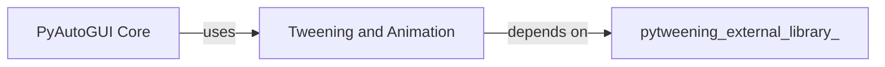

## Component Details

The Tweening and Animation component in PyAutoGUI is crucial for creating smooth and natural mouse movements. It provides various easing functions that dictate the acceleration and deceleration of the cursor during automated tasks. This component integrates with the external 'pytweening' library for its core functionality, offering fallback implementations if the library is not available. The PyAutoGUI Core component utilizes these tweening functions to execute animated mouse movements, ensuring a more realistic user experience.

### Tweening and Animation
This component is responsible for managing and applying animation curves (tweening functions) to create smooth mouse movements. It primarily relies on functions imported from the pytweening library, with internal fallback implementations if pytweening is not available. These functions dictate the acceleration and deceleration of mouse cursor movements.

**Related Classes/Methods**:

- <a href="https://github.com/asweigart/pyautogui/blob/master/pyautogui/__init__.py#L30-L88" target="_blank" rel="noopener noreferrer">`pyautogui.__init__:easeInQuad` (30:88)</a>
- <a href="https://github.com/asweigart/pyautogui/blob/master/pyautogui/__init__.py#L30-L88" target="_blank" rel="noopener noreferrer">`pyautogui.__init__:easeOutQuad` (30:88)</a>
- <a href="https://github.com/asweigart/pyautogui/blob/master/pyautogui/__init__.py#L30-L88" target="_blank" rel="noopener noreferrer">`pyautogui.__init__:easeInOutQuad` (30:88)</a>
- <a href="https://github.com/asweigart/pyautogui/blob/master/pyautogui/__init__.py#L30-L88" target="_blank" rel="noopener noreferrer">`pyautogui.__init__:easeInCubic` (30:88)</a>
- <a href="https://github.com/asweigart/pyautogui/blob/master/pyautogui/__init__.py#L30-L88" target="_blank" rel="noopener noreferrer">`pyautogui.__init__:easeOutCubic` (30:88)</a>
- <a href="https://github.com/asweigart/pyautogui/blob/master/pyautogui/__init__.py#L30-L88" target="_blank" rel="noopener noreferrer">`pyautogui.__init__:easeInOutCubic` (30:88)</a>
- <a href="https://github.com/asweigart/pyautogui/blob/master/pyautogui/__init__.py#L30-L88" target="_blank" rel="noopener noreferrer">`pyautogui.__init__:easeInQuart` (30:88)</a>
- <a href="https://github.com/asweigart/pyautogui/blob/master/pyautogui/__init__.py#L30-L88" target="_blank" rel="noopener noreferrer">`pyautogui.__init__:easeOutQuart` (30:88)</a>
- <a href="https://github.com/asweigart/pyautogui/blob/master/pyautogui/__init__.py#L30-L88" target="_blank" rel="noopener noreferrer">`pyautogui.__init__:easeInOutQuart` (30:88)</a>
- <a href="https://github.com/asweigart/pyautogui/blob/master/pyautogui/__init__.py#L30-L88" target="_blank" rel="noopener noreferrer">`pyautogui.__init__:easeInQuint` (30:88)</a>
- <a href="https://github.com/asweigart/pyautogui/blob/master/pyautogui/__init__.py#L30-L88" target="_blank" rel="noopener noreferrer">`pyautogui.__init__:easeOutQuint` (30:88)</a>
- <a href="https://github.com/asweigart/pyautogui/blob/master/pyautogui/__init__.py#L30-L88" target="_blank" rel="noopener noreferrer">`pyautogui.__init__:easeInOutQuint` (30:88)</a>
- <a href="https://github.com/asweigart/pyautogui/blob/master/pyautogui/__init__.py#L30-L88" target="_blank" rel="noopener noreferrer">`pyautogui.__init__:easeInSine` (30:88)</a>
- <a href="https://github.com/asweigart/pyautogui/blob/master/pyautogui/__init__.py#L30-L88" target="_blank" rel="noopener noreferrer">`pyautogui.__init__:easeOutSine` (30:88)</a>
- <a href="https://github.com/asweigart/pyautogui/blob/master/pyautogui/__init__.py#L30-L88" target="_blank" rel="noopener noreferrer">`pyautogui.__init__:easeInOutSine` (30:88)</a>
- <a href="https://github.com/asweigart/pyautogui/blob/master/pyautogui/__init__.py#L30-L88" target="_blank" rel="noopener noreferrer">`pyautogui.__init__:easeInExpo` (30:88)</a>
- <a href="https://github.com/asweigart/pyautogui/blob/master/pyautogui/__init__.py#L30-L88" target="_blank" rel="noopener noreferrer">`pyautogui.__init__:easeOutExpo` (30:88)</a>
- <a href="https://github.com/asweigart/pyautogui/blob/master/pyautogui/__init__.py#L30-L88" target="_blank" rel="noopener noreferrer">`pyautogui.__init__:easeInOutExpo` (30:88)</a>
- <a href="https://github.com/asweigart/pyautogui/blob/master/pyautogui/__init__.py#L30-L88" target="_blank" rel="noopener noreferrer">`pyautogui.__init__:easeInCirc` (30:88)</a>
- <a href="https://github.com/asweigart/pyautogui/blob/master/pyautogui/__init__.py#L30-L88" target="_blank" rel="noopener noreferrer">`pyautogui.__init__:easeOutCirc` (30:88)</a>
- <a href="https://github.com/asweigart/pyautogui/blob/master/pyautogui/__init__.py#L30-L88" target="_blank" rel="noopener noreferrer">`pyautogui.__init__:easeInOutCirc` (30:88)</a>
- <a href="https://github.com/asweigart/pyautogui/blob/master/pyautogui/__init__.py#L30-L88" target="_blank" rel="noopener noreferrer">`pyautogui.__init__:easeInElastic` (30:88)</a>
- <a href="https://github.com/asweigart/pyautogui/blob/master/pyautogui/__init__.py#L30-L88" target="_blank" rel="noopener noreferrer">`pyautogui.__init__:easeOutElastic` (30:88)</a>
- <a href="https://github.com/asweigart/pyautogui/blob/master/pyautogui/__init__.py#L30-L88" target="_blank" rel="noopener noreferrer">`pyautogui.__init__:easeInOutElastic` (30:88)</a>
- <a href="https://github.com/asweigart/pyautogui/blob/master/pyautogui/__init__.py#L30-L88" target="_blank" rel="noopener noreferrer">`pyautogui.__init__:easeInBack` (30:88)</a>
- <a href="https://github.com/asweigart/pyautogui/blob/master/pyautogui/__init__.py#L30-L88" target="_blank" rel="noopener noreferrer">`pyautogui.__init__:easeOutBack` (30:88)</a>
- <a href="https://github.com/asweigart/pyautogui/blob/master/pyautogui/__init__.py#L30-L88" target="_blank" rel="noopener noreferrer">`pyautogui.__init__:easeInOutBack` (30:88)</a>
- <a href="https://github.com/asweigart/pyautogui/blob/master/pyautogui/__init__.py#L30-L88" target="_blank" rel="noopener noreferrer">`pyautogui.__init__:easeInBounce` (30:88)</a>
- <a href="https://github.com/asweigart/pyautogui/blob/master/pyautogui/__init__.py#L30-L88" target="_blank" rel="noopener noreferrer">`pyautogui.__init__:easeOutBounce` (30:88)</a>
- <a href="https://github.com/asweigart/pyautogui/blob/master/pyautogui/__init__.py#L30-L88" target="_blank" rel="noopener noreferrer">`pyautogui.__init__:easeInOutBounce` (30:88)</a>
- <a href="https://github.com/asweigart/pyautogui/blob/master/pyautogui/__init__.py#L51-L57" target="_blank" rel="noopener noreferrer">`pyautogui.__init__._couldNotImportPyTweening` (51:57)</a>

### PyAutoGUI Core
This component provides the main high-level API for PyAutoGUI, handling general mouse and keyboard automation, global settings, and orchestrating calls to platform-specific modules. It also includes utility functions for calculations, error handling, and the core logic for mouse movement and dragging, which utilizes tweening functions.

**Related Classes/Methods**:

- <a href="https://github.com/asweigart/pyautogui/blob/master/pyautogui/__init__.py#L617-L628" target="_blank" rel="noopener noreferrer">`pyautogui.__init__.linear` (617:628)</a>
- <a href="https://github.com/asweigart/pyautogui/blob/master/pyautogui/__init__.py#L1417-L1514" target="_blank" rel="noopener noreferrer">`pyautogui.__init__._mouseMoveDrag` (1417:1514)</a>
- <a href="https://github.com/asweigart/pyautogui/blob/master/pyautogui/__init__.py#L752-L774" target="_blank" rel="noopener noreferrer">`pyautogui.__init__.position` (752:774)</a>
- <a href="https://github.com/asweigart/pyautogui/blob/master/pyautogui/__init__.py#L777-L783" target="_blank" rel="noopener noreferrer">`pyautogui.__init__.size` (777:783)</a>
- <a href="https://github.com/asweigart/pyautogui/blob/master/pyautogui/__init__.py#L605-L614" target="_blank" rel="noopener noreferrer">`pyautogui.__init__.getPointOnLine` (605:614)</a>
- <a href="https://github.com/asweigart/pyautogui/blob/master/pyautogui/__init__.py#L1732-L1736" target="_blank" rel="noopener noreferrer">`pyautogui.__init__.failSafeCheck` (1732:1736)</a>
- <a href="https://github.com/asweigart/pyautogui/blob/master/pyautogui/__init__.py#L642-L703" target="_blank" rel="noopener noreferrer">`pyautogui.__init__._normalizeXYArgs` (642:703)</a>
- <a href="https://github.com/asweigart/pyautogui/blob/master/pyautogui/__init__.py#L825-L879" target="_blank" rel="noopener noreferrer">`pyautogui.__init__._normalizeButton` (825:879)</a>
- <a href="https://github.com/asweigart/pyautogui/blob/master/pyautogui/__init__.py#L585-L598" target="_blank" rel="noopener noreferrer">`pyautogui.__init__._genericPyAutoGUIChecks` (585:598)</a>
- <a href="https://github.com/asweigart/pyautogui/blob/master/pyautogui/__init__.py#L631-L639" target="_blank" rel="noopener noreferrer">`pyautogui.__init__._handlePause` (631:639)</a>
- <a href="https://github.com/asweigart/pyautogui/blob/master/pyautogui/__init__.py#L883-L912" target="_blank" rel="noopener noreferrer">`pyautogui.__init__.mouseDown` (883:912)</a>
- <a href="https://github.com/asweigart/pyautogui/blob/master/pyautogui/__init__.py#L916-L945" target="_blank" rel="noopener noreferrer">`pyautogui.__init__.mouseUp` (916:945)</a>
- <a href="https://github.com/asweigart/pyautogui/blob/master/pyautogui/__init__.py#L949-L1003" target="_blank" rel="noopener noreferrer">`pyautogui.__init__.click` (949:1003)</a>
- <a href="https://github.com/asweigart/pyautogui/blob/master/pyautogui/__init__.py#L1007-L1033" target="_blank" rel="noopener noreferrer">`pyautogui.__init__.leftClick` (1007:1033)</a>
- <a href="https://github.com/asweigart/pyautogui/blob/master/pyautogui/__init__.py#L1037-L1061" target="_blank" rel="noopener noreferrer">`pyautogui.__init__.rightClick` (1037:1061)</a>
- <a href="https://github.com/asweigart/pyautogui/blob/master/pyautogui/__init__.py#L1065-L1086" target="_blank" rel="noopener noreferrer">`pyautogui.__init__.middleClick` (1065:1086)</a>
- <a href="https://github.com/asweigart/pyautogui/blob/master/pyautogui/__init__.py#L1090-L1129" target="_blank" rel="noopener noreferrer">`pyautogui.__init__.doubleClick` (1090:1129)</a>
- <a href="https://github.com/asweigart/pyautogui/blob/master/pyautogui/__init__.py#L1133-L1171" target="_blank" rel="noopener noreferrer">`pyautogui.__init__.tripleClick` (1133:1171)</a>
- <a href="https://github.com/asweigart/pyautogui/blob/master/pyautogui/__init__.py#L1175-L1201" target="_blank" rel="noopener noreferrer">`pyautogui.__init__.scroll` (1175:1201)</a>
- <a href="https://github.com/asweigart/pyautogui/blob/master/pyautogui/__init__.py#L1205-L1229" target="_blank" rel="noopener noreferrer">`pyautogui.__init__.hscroll` (1205:1229)</a>
- <a href="https://github.com/asweigart/pyautogui/blob/master/pyautogui/__init__.py#L1233-L1257" target="_blank" rel="noopener noreferrer">`pyautogui.__init__.vscroll` (1233:1257)</a>
- <a href="https://github.com/asweigart/pyautogui/blob/master/pyautogui/__init__.py#L1261-L1288" target="_blank" rel="noopener noreferrer">`pyautogui.__init__.moveTo` (1261:1288)</a>
- <a href="https://github.com/asweigart/pyautogui/blob/master/pyautogui/__init__.py#L1292-L1318" target="_blank" rel="noopener noreferrer">`pyautogui.__init__.moveRel` (1292:1318)</a>
- <a href="https://github.com/asweigart/pyautogui/blob/master/pyautogui/__init__.py#L1325-L1362" target="_blank" rel="noopener noreferrer">`pyautogui.__init__.dragTo` (1325:1362)</a>
- <a href="https://github.com/asweigart/pyautogui/blob/master/pyautogui/__init__.py#L1366-L1411" target="_blank" rel="noopener noreferrer">`pyautogui.__init__.dragRel` (1366:1411)</a>
- <a href="https://github.com/asweigart/pyautogui/blob/master/pyautogui/__init__.py#L1542-L1560" target="_blank" rel="noopener noreferrer">`pyautogui.__init__.keyDown` (1542:1560)</a>
- <a href="https://github.com/asweigart/pyautogui/blob/master/pyautogui/__init__.py#L1564-L1578" target="_blank" rel="noopener noreferrer">`pyautogui.__init__.keyUp` (1564:1578)</a>
- <a href="https://github.com/asweigart/pyautogui/blob/master/pyautogui/__init__.py#L1582-L1616" target="_blank" rel="noopener noreferrer">`pyautogui.__init__.press` (1582:1616)</a>
- <a href="https://github.com/asweigart/pyautogui/blob/master/pyautogui/__init__.py#L1621-L1654" target="_blank" rel="noopener noreferrer">`pyautogui.__init__.hold` (1621:1654)</a>
- <a href="https://github.com/asweigart/pyautogui/blob/master/pyautogui/__init__.py#L1658-L1687" target="_blank" rel="noopener noreferrer">`pyautogui.__init__.typewrite` (1658:1687)</a>
- <a href="https://github.com/asweigart/pyautogui/blob/master/pyautogui/__init__.py#L1694-L1726" target="_blank" rel="noopener noreferrer">`pyautogui.__init__.hotkey` (1694:1726)</a>
- <a href="https://github.com/asweigart/pyautogui/blob/master/pyautogui/__init__.py#L2089-L2147" target="_blank" rel="noopener noreferrer">`pyautogui.__init__.run` (2089:2147)</a>
- <a href="https://github.com/asweigart/pyautogui/blob/master/pyautogui/__init__.py#L1805-L1806" target="_blank" rel="noopener noreferrer">`pyautogui.__init__.sleep` (1805:1806)</a>
- <a href="https://github.com/asweigart/pyautogui/blob/master/pyautogui/__init__.py#L1809-L1813" target="_blank" rel="noopener noreferrer">`pyautogui.__init__.countdown` (1809:1813)</a>

### [FAQ](https://github.com/CodeBoarding/GeneratedOnBoardings/tree/main?tab=readme-ov-file#faq)