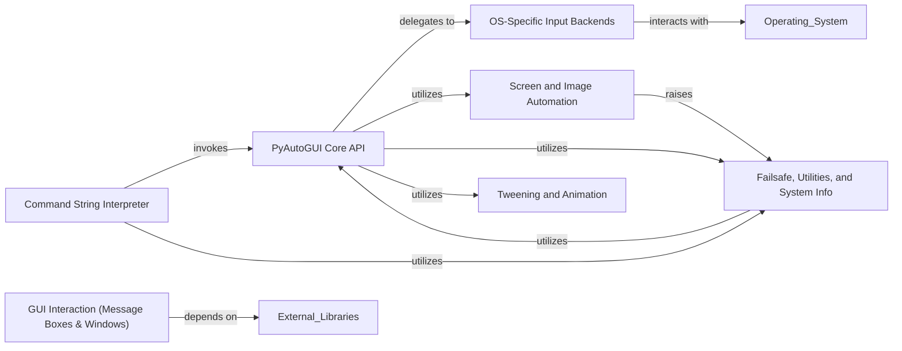

## Component Details

The PyAutoGUI library provides a cross-platform solution for programmatically controlling the mouse and keyboard, performing screen captures, and interacting with GUI elements. Its main flow involves high-level API calls that delegate to OS-specific backends for actual input simulation. It also includes functionalities for image recognition, failsafe mechanisms, command string interpretation, and GUI interaction, making it a comprehensive tool for GUI automation.

### PyAutoGUI Core API
The central module providing high-level functions for automating mouse, keyboard, and scroll actions. It orchestrates calls to OS-specific backends and integrates with other utility components, acting as the primary interface for users.

**Related Classes/Methods**:

- <a href="https://github.com/asweigart/pyautogui/blob/master/pyautogui/__init__.py#L883-L912" target="_blank" rel="noopener noreferrer">`pyautogui.__init__:mouseDown` (883:912)</a>
- <a href="https://github.com/asweigart/pyautogui/blob/master/pyautogui/__init__.py#L916-L945" target="_blank" rel="noopener noreferrer">`pyautogui.__init__:mouseUp` (916:945)</a>
- <a href="https://github.com/asweigart/pyautogui/blob/master/pyautogui/__init__.py#L949-L1003" target="_blank" rel="noopener noreferrer">`pyautogui.__init__:click` (949:1003)</a>
- <a href="https://github.com/asweigart/pyautogui/blob/master/pyautogui/__init__.py#L1007-L1033" target="_blank" rel="noopener noreferrer">`pyautogui.__init__:leftClick` (1007:1033)</a>
- <a href="https://github.com/asweigart/pyautogui/blob/master/pyautogui/__init__.py#L1037-L1061" target="_blank" rel="noopener noreferrer">`pyautogui.__init__:rightClick` (1037:1061)</a>
- <a href="https://github.com/asweigart/pyautogui/blob/master/pyautogui/__init__.py#L1065-L1086" target="_blank" rel="noopener noreferrer">`pyautogui.__init__:middleClick` (1065:1086)</a>
- <a href="https://github.com/asweigart/pyautogui/blob/master/pyautogui/__init__.py#L1090-L1129" target="_blank" rel="noopener noreferrer">`pyautogui.__init__:doubleClick` (1090:1129)</a>
- <a href="https://github.com/asweigart/pyautogui/blob/master/pyautogui/__init__.py#L1133-L1171" target="_blank" rel="noopener noreferrer">`pyautogui.__init__:tripleClick` (1133:1171)</a>
- <a href="https://github.com/asweigart/pyautogui/blob/master/pyautogui/__init__.py#L1175-L1201" target="_blank" rel="noopener noreferrer">`pyautogui.__init__:scroll` (1175:1201)</a>
- <a href="https://github.com/asweigart/pyautogui/blob/master/pyautogui/__init__.py#L1205-L1229" target="_blank" rel="noopener noreferrer">`pyautogui.__init__:hscroll` (1205:1229)</a>
- <a href="https://github.com/asweigart/pyautogui/blob/master/pyautogui/__init__.py#L1233-L1257" target="_blank" rel="noopener noreferrer">`pyautogui.__init__:vscroll` (1233:1257)</a>
- <a href="https://github.com/asweigart/pyautogui/blob/master/pyautogui/__init__.py#L1261-L1288" target="_blank" rel="noopener noreferrer">`pyautogui.__init__:moveTo` (1261:1288)</a>
- <a href="https://github.com/asweigart/pyautogui/blob/master/pyautogui/__init__.py#L1292-L1318" target="_blank" rel="noopener noreferrer">`pyautogui.__init__:moveRel` (1292:1318)</a>
- <a href="https://github.com/asweigart/pyautogui/blob/master/pyautogui/__init__.py#L1325-L1362" target="_blank" rel="noopener noreferrer">`pyautogui.__init__:dragTo` (1325:1362)</a>
- <a href="https://github.com/asweigart/pyautogui/blob/master/pyautogui/__init__.py#L1366-L1411" target="_blank" rel="noopener noreferrer">`pyautogui.__init__:dragRel` (1366:1411)</a>
- <a href="https://github.com/asweigart/pyautogui/blob/master/pyautogui/__init__.py#L1542-L1560" target="_blank" rel="noopener noreferrer">`pyautogui.__init__:keyDown` (1542:1560)</a>
- <a href="https://github.com/asweigart/pyautogui/blob/master/pyautogui/__init__.py#L1564-L1578" target="_blank" rel="noopener noreferrer">`pyautogui.__init__:keyUp` (1564:1578)</a>
- <a href="https://github.com/asweigart/pyautogui/blob/master/pyautogui/__init__.py#L1582-L1616" target="_blank" rel="noopener noreferrer">`pyautogui.__init__:press` (1582:1616)</a>
- <a href="https://github.com/asweigart/pyautogui/blob/master/pyautogui/__init__.py#L1621-L1654" target="_blank" rel="noopener noreferrer">`pyautogui.__init__:hold` (1621:1654)</a>
- <a href="https://github.com/asweigart/pyautogui/blob/master/pyautogui/__init__.py#L1658-L1687" target="_blank" rel="noopener noreferrer">`pyautogui.__init__:typewrite` (1658:1687)</a>
- <a href="https://github.com/asweigart/pyautogui/blob/master/pyautogui/__init__.py#L1694-L1726" target="_blank" rel="noopener noreferrer">`pyautogui.__init__:hotkey` (1694:1726)</a>
- <a href="https://github.com/asweigart/pyautogui/blob/master/pyautogui/__init__.py#L752-L774" target="_blank" rel="noopener noreferrer">`pyautogui.__init__:position` (752:774)</a>
- <a href="https://github.com/asweigart/pyautogui/blob/master/pyautogui/__init__.py#L777-L783" target="_blank" rel="noopener noreferrer">`pyautogui.__init__:size` (777:783)</a>
- <a href="https://github.com/asweigart/pyautogui/blob/master/pyautogui/__init__.py#L789-L809" target="_blank" rel="noopener noreferrer">`pyautogui.__init__:onScreen` (789:809)</a>
- <a href="https://github.com/asweigart/pyautogui/blob/master/pyautogui/__init__.py#L170-L170" target="_blank" rel="noopener noreferrer">`pyautogui.__init__:Point` (170:170)</a>
- <a href="https://github.com/asweigart/pyautogui/blob/master/pyautogui/__init__.py#L171-L171" target="_blank" rel="noopener noreferrer">`pyautogui.__init__:Size` (171:171)</a>
- <a href="https://github.com/asweigart/pyautogui/blob/master/pyautogui/__init__.py#L642-L703" target="_blank" rel="noopener noreferrer">`pyautogui.__init__:_normalizeXYArgs` (642:703)</a>
- <a href="https://github.com/asweigart/pyautogui/blob/master/pyautogui/__init__.py#L825-L879" target="_blank" rel="noopener noreferrer">`pyautogui.__init__:_normalizeButton` (825:879)</a>
- <a href="https://github.com/asweigart/pyautogui/blob/master/pyautogui/__init__.py#L1417-L1514" target="_blank" rel="noopener noreferrer">`pyautogui.__init__:_mouseMoveDrag` (1417:1514)</a>
- <a href="https://github.com/asweigart/pyautogui/blob/master/pyautogui/__init__.py#L585-L598" target="_blank" rel="noopener noreferrer">`pyautogui.__init__:_genericPyAutoGUIChecks` (585:598)</a>
- <a href="https://github.com/asweigart/pyautogui/blob/master/pyautogui/__init__.py#L631-L639" target="_blank" rel="noopener noreferrer">`pyautogui.__init__:_handlePause` (631:639)</a>
- <a href="https://github.com/asweigart/pyautogui/blob/master/pyautogui/__init__.py#L706-L749" target="_blank" rel="noopener noreferrer">`pyautogui.__init__:_logScreenshot` (706:749)</a>
- <a href="https://github.com/asweigart/pyautogui/blob/master/pyautogui/__init__.py#L617-L628" target="_blank" rel="noopener noreferrer">`pyautogui.__init__:linear` (617:628)</a>
- <a href="https://github.com/asweigart/pyautogui/blob/master/pyautogui/__init__.py#L605-L614" target="_blank" rel="noopener noreferrer">`pyautogui.__init__:getPointOnLine` (605:614)</a>
- <a href="https://github.com/asweigart/pyautogui/blob/master/pyautogui/__init__.py#L526-L532" target="_blank" rel="noopener noreferrer">`pyautogui.__init__:isShiftCharacter` (526:532)</a>
- <a href="https://github.com/asweigart/pyautogui/blob/master/pyautogui/__init__.py#L1521-L1538" target="_blank" rel="noopener noreferrer">`pyautogui.__init__:isValidKey` (1521:1538)</a>

### OS-Specific Input Backends
Provides the low-level, platform-dependent implementations for simulating mouse and keyboard events. This component is dynamically loaded based on the operating system (macOS, Windows, or X11/Linux).

**Related Classes/Methods**:

- `pyautogui._pyautogui_osx` (full file reference)
- `pyautogui._pyautogui_win` (full file reference)
- `pyautogui._pyautogui_x11` (full file reference)
- <a href="https://github.com/asweigart/pyautogui/blob/master/pyautogui/__init__.py#L150-L158" target="_blank" rel="noopener noreferrer">`pyautogui.__init__:platformModule` (150:158)</a>

### Screen and Image Automation
Handles functionalities related to screen capturing, locating images on the screen, and providing pixel color information.

**Related Classes/Methods**:

- <a href="https://github.com/asweigart/pyautogui/blob/master/pyautogui/__init__.py#L80-L82" target="_blank" rel="noopener noreferrer">`pyautogui.__init__:locate` (80:82)</a>
- <a href="https://github.com/asweigart/pyautogui/blob/master/pyautogui/__init__.py#L85-L87" target="_blank" rel="noopener noreferrer">`pyautogui.__init__:locateAll` (85:87)</a>
- <a href="https://github.com/asweigart/pyautogui/blob/master/pyautogui/__init__.py#L90-L92" target="_blank" rel="noopener noreferrer">`pyautogui.__init__:locateAllOnScreen` (90:92)</a>
- <a href="https://github.com/asweigart/pyautogui/blob/master/pyautogui/__init__.py#L95-L97" target="_blank" rel="noopener noreferrer">`pyautogui.__init__:locateCenterOnScreen` (95:97)</a>
- <a href="https://github.com/asweigart/pyautogui/blob/master/pyautogui/__init__.py#L100-L102" target="_blank" rel="noopener noreferrer">`pyautogui.__init__:locateOnScreen` (100:102)</a>
- <a href="https://github.com/asweigart/pyautogui/blob/master/pyautogui/__init__.py#L105-L107" target="_blank" rel="noopener noreferrer">`pyautogui.__init__:locateOnWindow` (105:107)</a>
- <a href="https://github.com/asweigart/pyautogui/blob/master/pyautogui/__init__.py#L72-L72" target="_blank" rel="noopener noreferrer">`pyautogui.__init__:screenshot` (72:72)</a>
- <a href="https://github.com/asweigart/pyautogui/blob/master/pyautogui/__init__.py#L72-L72" target="_blank" rel="noopener noreferrer">`pyautogui.__init__:pixel` (72:72)</a>
- <a href="https://github.com/asweigart/pyautogui/blob/master/pyautogui/__init__.py#L72-L72" target="_blank" rel="noopener noreferrer">`pyautogui.__init__:pixelMatchesColor` (72:72)</a>
- <a href="https://github.com/asweigart/pyautogui/blob/master/pyautogui/__init__.py#L162-L176" target="_blank" rel="noopener noreferrer">`pyautogui.__init__:raisePyAutoGUIImageNotFoundException` (162:176)</a>

### Failsafe, Utilities, and System Info
Implements safety mechanisms, general utility functions, error handling, and provides system information and debugging tools.

**Related Classes/Methods**:

- <a href="https://github.com/asweigart/pyautogui/blob/master/pyautogui/__init__.py#L29-L36" target="_blank" rel="noopener noreferrer">`pyautogui.__init__:PyAutoGUIException` (29:36)</a>
- <a href="https://github.com/asweigart/pyautogui/blob/master/pyautogui/__init__.py#L39-L46" target="_blank" rel="noopener noreferrer">`pyautogui.__init__:FailSafeException` (39:46)</a>
- <a href="https://github.com/asweigart/pyautogui/blob/master/pyautogui/__init__.py#L49-L55" target="_blank" rel="noopener noreferrer">`pyautogui.__init__:ImageNotFoundException` (49:55)</a>
- <a href="https://github.com/asweigart/pyautogui/blob/master/pyautogui/__init__.py#L1732-L1736" target="_blank" rel="noopener noreferrer">`pyautogui.__init__:failSafeCheck` (1732:1736)</a>
- <a href="https://github.com/asweigart/pyautogui/blob/master/pyautogui/__init__.py#L267-L281" target="_blank" rel="noopener noreferrer">`pyautogui.__init__:useImageNotFoundException` (267:281)</a>
- <a href="https://github.com/asweigart/pyautogui/blob/master/pyautogui/__init__.py#L1739-L1776" target="_blank" rel="noopener noreferrer">`pyautogui.__init__:displayMousePosition` (1739:1776)</a>
- <a href="https://github.com/asweigart/pyautogui/blob/master/pyautogui/__init__.py#L2165-L2166" target="_blank" rel="noopener noreferrer">`pyautogui.__init__:getInfo` (2165:2166)</a>
- <a href="https://github.com/asweigart/pyautogui/blob/master/pyautogui/__init__.py#L2150-L2162" target="_blank" rel="noopener noreferrer">`pyautogui.__init__:printInfo` (2150:2162)</a>
- <a href="https://github.com/asweigart/pyautogui/blob/master/pyautogui/__init__.py#L1779-L1802" target="_blank" rel="noopener noreferrer">`pyautogui.__init__:_snapshot` (1779:1802)</a>
- <a href="https://github.com/asweigart/pyautogui/blob/master/pyautogui/__init__.py#L1805-L1806" target="_blank" rel="noopener noreferrer">`pyautogui.__init__:sleep` (1805:1806)</a>
- <a href="https://github.com/asweigart/pyautogui/blob/master/pyautogui/__init__.py#L1809-L1813" target="_blank" rel="noopener noreferrer">`pyautogui.__init__:countdown` (1809:1813)</a>

### Command String Interpreter
Parses and executes a mini-language of PyAutoGUI commands provided as a string, enabling script-like execution from a simplified text format.

**Related Classes/Methods**:

- <a href="https://github.com/asweigart/pyautogui/blob/master/pyautogui/__init__.py#L2089-L2147" target="_blank" rel="noopener noreferrer">`pyautogui.__init__:run` (2089:2147)</a>
- <a href="https://github.com/asweigart/pyautogui/blob/master/pyautogui/__init__.py#L1905-L2028" target="_blank" rel="noopener noreferrer">`pyautogui.__init__:_tokenizeCommandStr` (1905:2028)</a>
- <a href="https://github.com/asweigart/pyautogui/blob/master/pyautogui/__init__.py#L2031-L2086" target="_blank" rel="noopener noreferrer">`pyautogui.__init__:_runCommandList` (2031:2086)</a>
- <a href="https://github.com/asweigart/pyautogui/blob/master/pyautogui/__init__.py#L1816-L1832" target="_blank" rel="noopener noreferrer">`pyautogui.__init__:_getNumberToken` (1816:1832)</a>
- <a href="https://github.com/asweigart/pyautogui/blob/master/pyautogui/__init__.py#L1835-L1849" target="_blank" rel="noopener noreferrer">`pyautogui.__init__:_getQuotedStringToken` (1835:1849)</a>
- <a href="https://github.com/asweigart/pyautogui/blob/master/pyautogui/__init__.py#L1852-L1886" target="_blank" rel="noopener noreferrer">`pyautogui.__init__:_getParensCommandStrToken` (1852:1886)</a>
- <a href="https://github.com/asweigart/pyautogui/blob/master/pyautogui/__init__.py#L1889-L1902" target="_blank" rel="noopener noreferrer">`pyautogui.__init__:_getCommaToken` (1889:1902)</a>

### GUI Interaction (Message Boxes & Windows)
Provides interfaces for displaying message boxes and managing windows, relying on external libraries like pymsgbox and pygetwindow.

**Related Classes/Methods**:

- <a href="https://github.com/asweigart/pyautogui/blob/master/pyautogui/__init__.py#L50-L50" target="_blank" rel="noopener noreferrer">`pyautogui.__init__:alert` (50:50)</a>
- <a href="https://github.com/asweigart/pyautogui/blob/master/pyautogui/__init__.py#L50-L50" target="_blank" rel="noopener noreferrer">`pyautogui.__init__:confirm` (50:50)</a>
- <a href="https://github.com/asweigart/pyautogui/blob/master/pyautogui/__init__.py#L50-L50" target="_blank" rel="noopener noreferrer">`pyautogui.__init__:prompt` (50:50)</a>
- <a href="https://github.com/asweigart/pyautogui/blob/master/pyautogui/__init__.py#L50-L50" target="_blank" rel="noopener noreferrer">`pyautogui.__init__:password` (50:50)</a>
- <a href="https://github.com/asweigart/pyautogui/blob/master/pyautogui/__init__.py#L127-L133" target="_blank" rel="noopener noreferrer">`pyautogui.__init__:Window` (127:133)</a>
- <a href="https://github.com/asweigart/pyautogui/blob/master/pyautogui/__init__.py#L127-L133" target="_blank" rel="noopener noreferrer">`pyautogui.__init__:getActiveWindow` (127:133)</a>
- <a href="https://github.com/asweigart/pyautogui/blob/master/pyautogui/__init__.py#L127-L133" target="_blank" rel="noopener noreferrer">`pyautogui.__init__:getActiveWindowTitle` (127:133)</a>
- <a href="https://github.com/asweigart/pyautogui/blob/master/pyautogui/__init__.py#L127-L133" target="_blank" rel="noopener noreferrer">`pyautogui.__init__:getWindowsAt` (127:133)</a>
- <a href="https://github.com/asweigart/pyautogui/blob/master/pyautogui/__init__.py#L127-L133" target="_blank" rel="noopener noreferrer">`pyautogui.__init__:getWindowsWithTitle` (127:133)</a>
- <a href="https://github.com/asweigart/pyautogui/blob/master/pyautogui/__init__.py#L127-L133" target="_blank" rel="noopener noreferrer">`pyautogui.__init__:getAllWindows` (127:133)</a>
- <a href="https://github.com/asweigart/pyautogui/blob/master/pyautogui/__init__.py#L127-L133" target="_blank" rel="noopener noreferrer">`pyautogui.__init__:getAllTitles` (127:133)</a>
- <a href="https://github.com/asweigart/pyautogui/blob/master/pyautogui/__init__.py#L110-L116" target="_blank" rel="noopener noreferrer">`pyautogui.__init__:mouseInfo` (110:116)</a>

### Tweening and Animation
Manages the animation curves for smooth mouse movements, primarily using functions imported from the pytweening library or its internal fallback implementations.

**Related Classes/Methods**:

- <a href="https://github.com/asweigart/pyautogui/blob/master/pyautogui/__init__.py#L30-L48" target="_blank" rel="noopener noreferrer">`pyautogui.__init__:easeInQuad` (30:48)</a>
- <a href="https://github.com/asweigart/pyautogui/blob/master/pyautogui/__init__.py#L30-L48" target="_blank" rel="noopener noreferrer">`pyautogui.__init__:easeOutQuad` (30:48)</a>
- <a href="https://github.com/asweigart/pyautogui/blob/master/pyautogui/__init__.py#L30-L48" target="_blank" rel="noopener noreferrer">`pyautogui.__init__:easeInOutQuad` (30:48)</a>
- <a href="https://github.com/asweigart/pyautogui/blob/master/pyautogui/__init__.py#L30-L48" target="_blank" rel="noopener noreferrer">`pyautogui.__init__:easeInCubic` (30:48)</a>
- <a href="https://github.com/asweigart/pyautogui/blob/master/pyautogui/__init__.py#L30-L48" target="_blank" rel="noopener noreferrer">`pyautogui.__init__:easeOutCubic` (30:48)</a>
- <a href="https://github.com/asweigart/pyautogui/blob/master/pyautogui/__init__.py#L30-L48" target="_blank" rel="noopener noreferrer">`pyautogui.__init__:easeInOutCubic` (30:48)</a>
- <a href="https://github.com/asweigart/pyautogui/blob/master/pyautogui/__init__.py#L30-L48" target="_blank" rel="noopener noreferrer">`pyautogui.__init__:easeInQuart` (30:48)</a>
- <a href="https://github.com/asweigart/pyautogui/blob/master/pyautogui/__init__.py#L30-L48" target="_blank" rel="noopener noreferrer">`pyautogui.__init__:easeOutQuart` (30:48)</a>
- <a href="https://github.com/asweigart/pyautogui/blob/master/pyautogui/__init__.py#L30-L48" target="_blank" rel="noopener noreferrer">`pyautogui.__init__:easeInOutQuart` (30:48)</a>
- <a href="https://github.com/asweigart/pyautogui/blob/master/pyautogui/__init__.py#L30-L48" target="_blank" rel="noopener noreferrer">`pyautogui.__init__:easeInQuint` (30:48)</a>
- <a href="https://github.com/asweigart/pyautogui/blob/master/pyautogui/__init__.py#L30-L48" target="_blank" rel="noopener noreferrer">`pyautogui.__init__:easeOutQuint` (30:48)</a>
- <a href="https://github.com/asweigart/pyautogui/blob/master/pyautogui/__init__.py#L30-L48" target="_blank" rel="noopener noreferrer">`pyautogui.__init__:easeInOutQuint` (30:48)</a>
- <a href="https://github.com/asweigart/pyautogui/blob/master/pyautogui/__init__.py#L30-L48" target="_blank" rel="noopener noreferrer">`pyautogui.__init__:easeInSine` (30:48)</a>
- <a href="https://github.com/asweigart/pyautogui/blob/master/pyautogui/__init__.py#L30-L48" target="_blank" rel="noopener noreferrer">`pyautogui.__init__:easeOutSine` (30:48)</a>
- <a href="https://github.com/asweigart/pyautogui/blob/master/pyautogui/__init__.py#L30-L48" target="_blank" rel="noopener noreferrer">`pyautogui.__init__:easeInOutSine` (30:48)</a>
- <a href="https://github.com/asweigart/pyautogui/blob/master/pyautogui/__init__.py#L30-L48" target="_blank" rel="noopener noreferrer">`pyautogui.__init__:easeInExpo` (30:48)</a>
- <a href="https://github.com/asweigart/pyautogui/blob/master/pyautogui/__init__.py#L30-L48" target="_blank" rel="noopener noreferrer">`pyautogui.__init__:easeOutExpo` (30:48)</a>
- <a href="https://github.com/asweigart/pyautogui/blob/master/pyautogui/__init__.py#L30-L48" target="_blank" rel="noopener noreferrer">`pyautogui.__init__:easeInOutExpo` (30:48)</a>
- <a href="https://github.com/asweigart/pyautogui/blob/master/pyautogui/__init__.py#L30-L48" target="_blank" rel="noopener noreferrer">`pyautogui.__init__:easeInCirc` (30:48)</a>
- <a href="https://github.com/asweigart/pyautogui/blob/master/pyautogui/__init__.py#L30-L48" target="_blank" rel="noopener noreferrer">`pyautogui.__init__:easeOutCirc` (30:48)</a>
- <a href="https://github.com/asweigart/pyautogui/blob/master/pyautogui/__init__.py#L30-L48" target="_blank" rel="noopener noreferrer">`pyautogui.__init__:easeInOutCirc` (30:48)</a>
- <a href="https://github.com/asweigart/pyautogui/blob/master/pyautogui/__init__.py#L30-L48" target="_blank" rel="noopener noreferrer">`pyautogui.__init__:easeInElastic` (30:48)</a>
- <a href="https://github.com/asweigart/pyautogui/blob/master/pyautogui/__init__.py#L30-L48" target="_blank" rel="noopener noreferrer">`pyautogui.__init__:easeOutElastic` (30:48)</a>
- <a href="https://github.com/asweigart/pyautogui/blob/master/pyautogui/__init__.py#L30-L48" target="_blank" rel="noopener noreferrer">`pyautogui.__init__:easeInOutElastic` (30:48)</a>
- <a href="https://github.com/asweigart/pyautogui/blob/master/pyautogui/__init__.py#L30-L48" target="_blank" rel="noopener noreferrer">`pyautogui.__init__:easeInBack` (30:48)</a>
- <a href="https://github.com/asweigart/pyautogui/blob/master/pyautogui/__init__.py#L30-L48" target="_blank" rel="noopener noreferrer">`pyautogui.__init__:easeOutBack` (30:48)</a>
- <a href="https://github.com/asweigart/pyautogui/blob/master/pyautogui/__init__.py#L30-L48" target="_blank" rel="noopener noreferrer">`pyautogui.__init__:easeInOutBack` (30:48)</a>
- <a href="https://github.com/asweigart/pyautogui/blob/master/pyautogui/__init__.py#L30-L48" target="_blank" rel="noopener noreferrer">`pyautogui.__init__:easeInBounce` (30:48)</a>
- <a href="https://github.com/asweigart/pyautogui/blob/master/pyautogui/__init__.py#L30-L48" target="_blank" rel="noopener noreferrer">`pyautogui.__init__:easeOutBounce` (30:48)</a>
- <a href="https://github.com/asweigart/pyautogui/blob/master/pyautogui/__init__.py#L30-L48" target="_blank" rel="noopener noreferrer">`pyautogui.__init__:easeInOutBounce` (30:48)</a>

### [FAQ](https://github.com/CodeBoarding/GeneratedOnBoardings/tree/main?tab=readme-ov-file#faq)